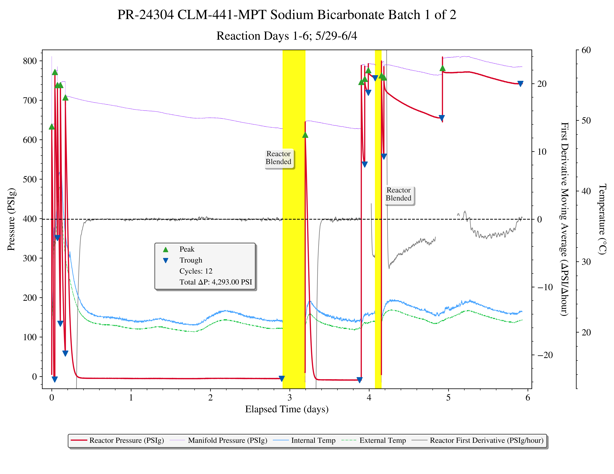
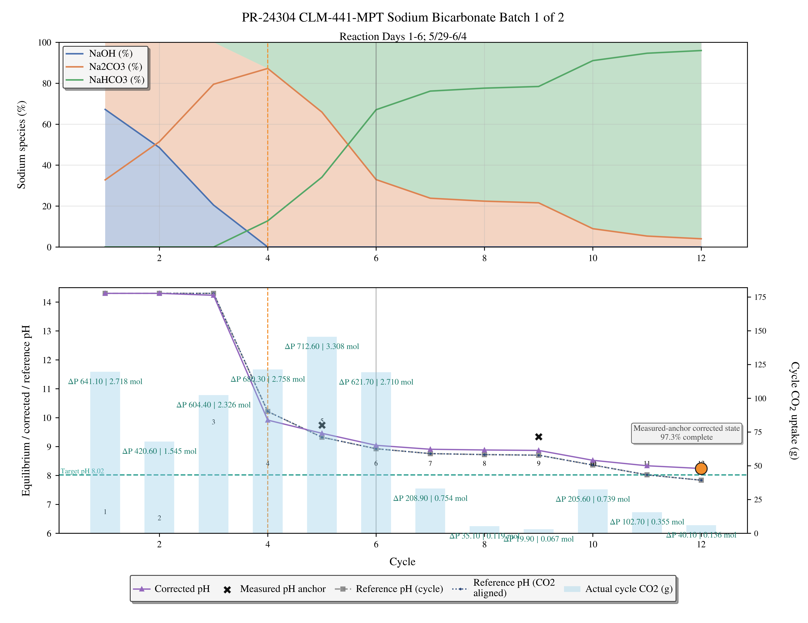

# GL-260 Equilibrium and Simulation Walkthrough (700 g NaOH Case)

## Purpose
This walkthrough will be used to understand the sodium bicarbonate reaction and all the challenges associated with it.

This walkthrough will show you how i compute:

- equilibrium pH,
- carbonate speciation,
- cycle CO2 uptake,
- measured-pH anchored calibration,
- residual ML pH correction in Analysis mode.
- real PR-24304 presentation data,
- HMW/PHREEQC Na-carbonate Pitzer pairing.

We will discuss how cycles are identified, uptake is calculated, pH is predicted for each cycle, and we will derive detailed equilibrium expressions that are used to calculate pH with +/- 0.5 accuracy.

## Locked Assumptions for This Walkthrough
All values in this document are locked to one deterministic scenario so intermediate results are reproducible during live explanation.

- Temperature: `Average temp used for each cycle`
- Water basis: `2,200 mL` pure water (`2.2 kg` water approximation)
- NaOH charge: `700 g`
- NaOH purity: `100%` (for this worked example)
- Synthetic fixed cycle uptake sequence (g CO2 per cycle):
  - `[80, 90, 100, 110, 120, 130, 130, 140]`
  - Total cumulative CO2: `900 g`
- Measured pH anchors (multi-anchor example):
  - Cycle 5: `pH = 9.74`
  - Cycle 9: `pH = 9.34`
- ML correction mode: enabled, with fail-closed anchor guard enforced.
- Real-world worked example profile:
  - `profiles/PR-24304 CLM-441-MPT Sodium Bicarbonate Batch 1 of 2.json`
  - reaction basis: `NaOH + CO2 -> NaHCO3`
  - starting NaOH basis in profile: `702.0 g`
  - product: sodium bicarbonate (`NaHCO3`)
  - embedded presentation plots:
    - `docs/assets/equilibrium-walkthrough/pr-24304-batch-1-cycle-speciation-timeline-day-1-6.png`
    - `docs/assets/equilibrium-walkthrough/pr-24304-batch-1-day-1-6-combined-triple-axis.png`

---

## 1) Basis Setup (700 g NaOH in 2,200 mL Water)

!!! note "Calculation Legend"
    - \(m_{\mathrm{NaOH}}\): NaOH mass charged to solution [`g`]
    - \(MW_{\mathrm{NaOH}}\): NaOH molecular weight [\(g mol^{-1}\)]
    - \(n_{\mathrm{NaOH}}\): NaOH amount [`mol`]
    - \(V_{\mathrm{liq}}\): liquid volume [`L`]
    - \(kg_{\mathrm{water}}\): water mass basis [`kg`]
    - \(C_{\mathrm{NaOH}}\): NaOH molarity [\(mol L^{-1}\)]
    - \(m_{\mathrm{NaT}}\): total sodium molality [\(mol kg^{-1}\)]
    - \(n_{\mathrm{CO_2,eq1}}\), \(n_{\mathrm{CO_2,eq2}}\): CO2 mole endpoints [`mol`]
    - \(m_{\mathrm{CO_2,eq1}}\), \(m_{\mathrm{CO_2,eq2}}\): CO2 mass endpoints [`g`]

Converting mass to molar/molal basis defines the two stoichiometric landmarks used for later calculations.

!!! info "Derivation Walkthrough"
    **Goal:** Convert NaOH mass into concentration terms that is used in every later equilibrium equation.

    **Step-by-step interpretation:** first compute \(n_{\mathrm{NaOH}}\), then normalize by liquid volume (\(C_{\mathrm{NaOH}}\)) and water mass (\(m_{\mathrm{NaT}}\)), then convert the two stoichiometric CO2 endpoints to grams.

    **Why this changes operation:** these endpoint masses define where bicarbonate formation can be maximized versus where carbonate carryover or leftover caustic are expected, so they are the first control landmarks for high-purity NaHCO3.

```latex
Mass NaOH = m_{\mathrm{NaOH}} = 700\ \mathrm{g}
```

```latex
MW_{\mathrm{NaOH}} = 40.00\ \mathrm{g\ mol^{-1}}
```

```latex
n_{\mathrm{NaOH}} = \frac{m_{\mathrm{NaOH}}}{MW_{\mathrm{NaOH}}}
```

```latex
n_{\mathrm{NaOH}} = \frac{700\ \mathrm{g}}{40.00\ \mathrm{g\ mol^{-1}}} = 17.5\ \mathrm{mol}
```

```latex
V_{\mathrm{liq}} = 2.200\ \mathrm{L}
```

```latex
kg_{\mathrm{water}} \approx 2.2\ \mathrm{kg}
```

```latex
C_{\mathrm{NaOH}} = \frac{n_{\mathrm{NaOH}}}{V_{\mathrm{liq}}}
```

```latex
C_{\mathrm{NaOH}} = \frac{17.5\ \mathrm{mol}}{2.200\ \mathrm{L}} = 7.9545\ \mathrm{mol\ L^{-1}}
```

```latex
m_{\mathrm{NaT}} = \frac{n_{\mathrm{NaOH}}}{kg_{\mathrm{water}}}
```

```latex
m_{\mathrm{NaT}} = \frac{17.5\ \mathrm{mol}}{2.2\ \mathrm{kg}} = 7.9545\ \mathrm{mol\ kg^{-1}}
```

Stoichiometric landmarks for CO2 addition:

```latex
n_{\mathrm{CO_2,eq1}} = \frac{n_{\mathrm{NaOH}}}{2} = 8.75\ \mathrm{mol}
```

```latex
m_{\mathrm{CO_2,eq1}} = n_{\mathrm{CO_2,eq1}} \times MW_{\mathrm{CO_2}}
```

```latex
m_{\mathrm{CO_2,eq1}} = 8.75\ \mathrm{mol} \times 44.01\ \mathrm{g\ mol^{-1}} \approx 385.1\ \mathrm{g}
```

```latex
n_{\mathrm{CO_2,eq2}} = n_{\mathrm{NaOH}} = 17.5\ \mathrm{mol}
```

```latex
m_{\mathrm{CO_2,eq2}} = n_{\mathrm{CO_2,eq2}} \times MW_{\mathrm{CO_2}}
```

```latex
m_{\mathrm{CO_2,eq2}} = 17.5\ \mathrm{mol} \times 44.01\ \mathrm{g\ mol^{-1}} \approx 770.2\ \mathrm{g}
```

!!! tip "Approximation Note"
    Approximation note: \(kg_{\mathrm{water}} \approx 2.2\ \mathrm{kg}\) assumes pure-water density near \(1.0\ \mathrm{kg\ L^{-1}}\).


<div class="inline-chart-anchor" data-inline-chart="stoich-impact"></div>


---

## 2) Equilibrium Half-Reactions, Constants, and Activities
These half-reactions and constants provide the thermodynamic constraints that all downstream pH/speciation calculations must satisfy.

### 2.1 Carbonate and Water Equilibrium Half-Reactions

!!! note "Calculation Legend"
    - \(K_{a1}\), \(K_{a2}\), `K_w`: equilibrium constants in activity form `[-]`
    - `a_i`: activity of species `i` `[-]`
    - \(\gamma_i\): activity coefficient of species `i` `[-]`
    - `m_i`: molality of species `i` [\(mol kg^{-1}\)]
    - `K_H`: Henry constant in the convention used by the model [\(mol kg^{-1} atm^{-1}\)]
    - \(p_{\mathrm{CO_2}}\): CO2 partial pressure [`atm`]
    - \([\mathrm{CO_2^*}]\): dissolved molecular CO2 plus hydrated carbonic acid basis [\(mol kg^{-1}\)]


<table class="reaction-map">
<thead>
<tr>
<th>Half Reaction</th>
<th>Equilibrium Expression</th>
</tr>
</thead>
<tbody>
<tr>
<td>\[\mathrm{CO_2^*} \rightleftharpoons \mathrm{H^+} + \mathrm{HCO_3^-}\]</td>
<td>\[K_{a1} = \frac{a_{\mathrm{H^+}} \times a_{\mathrm{HCO_3^-}}}{a_{\mathrm{CO_2^*}}}\]</td>
</tr>
<tr>
<td>\[\mathrm{HCO_3^-} \rightleftharpoons \mathrm{H^+} + \mathrm{CO_3^{2-}}\]</td>
<td>\[K_{a2} = \frac{a_{\mathrm{H^+}} \times a_{\mathrm{CO_3^{2-}}}}{a_{\mathrm{HCO_3^-}}}\]</td>
</tr>
<tr>
<td>\[\mathrm{H_2O} \rightleftharpoons \mathrm{H^+} + \mathrm{OH^-}\]</td>
<td>\[K_w = a_{\mathrm{H^+}} \times a_{\mathrm{OH^-}}\]</td>
</tr>
</tbody>
</table>

```latex
a_i = \gamma_i \times m_i
```

For fixed-headspace mode, dissolved CO2 boundary is constrained by Henry's law:

```latex
[\mathrm{CO_2^*}] = K_H \times p_{\mathrm{CO_2}}
```

### 2.2 Constants Used by the NaOH-CO2 Pitzer Example Path (25 C)

!!! note "Calculation Legend"
    - \(K_{a1}\): first dissociation constant of carbonic system `[-]`
    - \(K_{a2}\): second dissociation constant of carbonic system `[-]`
    - `K_w`: water autoionization constant `[-]`


In `naoh_co2_pitzer_ph_model.py`:

```latex
K_{a1} = 10^{-6.3374}
```

```latex
K_{a2} = 10^{-10.3393}
```

```latex
K_w \approx 10^{-14}
```

### 2.3 What Activities Change Compared With Concentrations

!!! note "Calculation Legend"
    - `ideal model`: assumes \(\gamma_i = 1\), so activity equals molality.
    - `activity-corrected model`: computes \(\gamma_i\), then uses \(a_i = \gamma_i m_i\).
    - `high ionic strength`: concentrated electrolyte condition where ion-ion interactions materially change apparent equilibrium behavior.

In a dilute classroom example, the model can often use concentration directly:

```latex
a_i \approx m_i
```

That approximation means each dissolved species behaves as though it were alone in water. The GL-260 NaOH case is not dilute: a 700 g NaOH charge in 2.2 kg water gives roughly `7.95 mol/kg` sodium basis before CO2 loading. At that ionic strength, sodium, hydroxide, bicarbonate, and carbonate are not independent. Each ion is surrounded by an ionic atmosphere, and the thermodynamic effective concentration is activity:

```latex
a_i = \gamma_i \times m_i
```

The activity coefficient \(\gamma_i\) is the correction term. If \(\gamma_i < 1\), the species is less thermodynamically active than its molality alone would imply. If \(\gamma_i > 1\), it is more active. Pitzer terms are used because they are designed for concentrated electrolyte solutions where Debye-Huckel-style dilute corrections are not enough.

For pH this distinction matters directly:

```latex
\mathrm{pH} = -\log_{10}(a_{\mathrm{H^+}})
```

not simply:

```latex
\mathrm{pH} = -\log_{10}(m_{\mathrm{H^+}})
```

The difference is why GL-260 treats the Pitzer path as the deepest sodium bicarbonate prediction path instead of relying only on ideal alpha fractions.

---

## 3) Complete Keq Expression

!!! note "Calculation Legend"
    - \(K_{b1}\), \(K_{b2}\): base-side equilibrium constants `[-]`
    - \(K_{eq,\mathrm{overall}}\): overall equilibrium constant `[-]`
    - \(a_{\mathrm{H_2O}}\): water activity `[-]`, often approximated as `1` in concentrated electrolyte simplifications

The overall equilibrium relationship is explicitly tied to the half-reaction constants, enabling direct inspection of the chemistry contract.

!!! info "Derivation Walkthrough"
    **Goal:** show that the full carbonate neutralization contract is exactly the product of the two base-consumption half steps.

    **Step-by-step interpretation:** define each half reaction, write \(K_{b1}\) and \(K_{b2}\) in activity form, then multiply them to recover the overall expression and map to \({K_{a1}, K_{a2}, K_w}\).

    **Why this changes operation:** this is the control bridge from chemistry theory to bicarbonate purity; if either half-step is unintentionally over-driven, the net pathway shifts away from NaHCO3 and toward carbonate.

GL-260's carbonate neutralization chemistry can be shown in two base-consumption half-steps:

<table class="reaction-map">
<thead>
<tr>
<th>Half Reaction</th>
<th>Equilibrium Expression / Calculation</th>
</tr>
</thead>
<tbody>
<tr>
<td>\[\mathrm{CO_2^*} + \mathrm{OH^-} \rightleftharpoons \mathrm{HCO_3^-}\]</td>
<td>\[K_{b1} = \frac{a_{\mathrm{HCO_3^-}}}{a_{\mathrm{CO_2^*}} \times a_{\mathrm{OH^-}}}\]<br>\[K_{b1} = \frac{K_{a1}}{K_w}\]</td>
</tr>
<tr>
<td>\[\mathrm{HCO_3^-} + \mathrm{OH^-} \rightleftharpoons \mathrm{CO_3^{2-}} + \mathrm{H_2O}\]</td>
<td>\[K_{b2} = \frac{a_{\mathrm{CO_3^{2-}}} \times a_{\mathrm{H_2O}}}{a_{\mathrm{HCO_3^-}} \times a_{\mathrm{OH^-}}}\]<br>\[K_{b2} \approx \frac{a_{\mathrm{CO_3^{2-}}}}{a_{\mathrm{HCO_3^-}} \times a_{\mathrm{OH^-}}}\]<br>\[K_{b2} = \frac{K_{a2}}{K_w}\]</td>
</tr>
</tbody>
</table>

### 3.1 Add Half Reactions to Recover the Overall Reaction
The overall carbonate-neutralization chemistry is the direct sum of the two half reactions above.

<table class="reaction-map">
<thead>
<tr>
<th>Reaction Assembly</th>
<th>Resulting Expression</th>
</tr>
</thead>
<tbody>
<tr>
<td>\[\left(\mathrm{CO_2^*} + \mathrm{OH^-} \rightleftharpoons \mathrm{HCO_3^-}\right) + \left(\mathrm{HCO_3^-} + \mathrm{OH^-} \rightleftharpoons \mathrm{CO_3^{2-}} + \mathrm{H_2O}\right)\]</td>
<td>Add the two half reactions and cancel the intermediate \(\mathrm{HCO_3^-}\) term.</td>
</tr>
<tr>
<td>\[\mathrm{CO_2^*} + 2\mathrm{OH^-} \rightleftharpoons \mathrm{CO_3^{2-}} + \mathrm{H_2O}\]</td>
<td>\[K_{eq,\mathrm{overall}} = K_{b1} \times K_{b2}\]</td>
</tr>
</tbody>
</table>

Operational implication for bicarbonate purity: the \(\mathrm{HCO_3^-}\) term cancels in the algebra because it is an intermediate produced in the first half-step and consumed in the second. This means bicarbonate quality is controlled by how strongly each half-step is driven in practice: we want to favor \(\mathrm{CO_2^*} + \mathrm{OH^-} \rightarrow \mathrm{HCO_3^-}\) while suppressing \(\mathrm{HCO_3^-} + \mathrm{OH^-} \rightarrow \mathrm{CO_3^{2-}} + \mathrm{H_2O}\), achieved by increasing dissolved CO2 (\(p_{\mathrm{CO_2}}\)), reducing effective \(\mathrm{OH^-}\) through loading stage progression, and avoiding excessive residual alkalinity.

The equilibrium constants multiply when reactions are added:

```latex
K_{eq,\mathrm{overall}}
=
\frac{a_{\mathrm{HCO_3^-}}}{a_{\mathrm{CO_2^*}} \times a_{\mathrm{OH^-}}}
\times
\frac{a_{\mathrm{CO_3^{2-}}} \times a_{\mathrm{H_2O}}}{a_{\mathrm{HCO_3^-}} \times a_{\mathrm{OH^-}}}
```

```latex
K_{eq,\mathrm{overall}} = \frac{a_{\mathrm{CO_3^{2-}}} \times a_{\mathrm{H_2O}}}{a_{\mathrm{CO_2^*}} \times a_{\mathrm{OH^-}}^2}
```

```latex
K_{eq,\mathrm{overall}} \approx \frac{a_{\mathrm{CO_3^{2-}}}}{a_{\mathrm{CO_2^*}} \times a_{\mathrm{OH^-}}^2}
\quad\text{when}\quad a_{\mathrm{H_2O}} \approx 1
```

In terms of acid and water constants:

```latex
K_{eq,\mathrm{overall}} = \frac{K_{a1} \times K_{a2}}{K_w^2}
```

!!! tip "Approximation Note"
    Approximation note: terms with \(\approx\) follow the common \(a_{\mathrm{H_2O}} \approx 1\) simplification used for interpretability.


---

## 4) Speciation and pH Derivation Used in GL-260

!!! note "Calculation Legend"
    - \([H^+]\), \([\mathrm{OH^-}]\), \([\mathrm{CO_2^*}]\), \([\mathrm{HCO_3^-}]\), \([\mathrm{CO_3^{2-}}]\), \([\mathrm{Na^+}]\): concentration/molarity-like model terms [\(mol L^{-1}\) or model-consistent concentration basis]
    - `C_T`: total inorganic carbon concentration on the same basis as reconstructed species
    - \(\alpha_0\), \(\alpha_1\), \(\alpha_2\): species fractions `[-]`
    - `D`: shared denominator in alpha-fraction identities
    - `R_q`: charge-balance residual on concentration basis (target is zero)

GL-260 solves charge balance to recover `[H+]`, then reconstructs species fractions and pH consistently from that solution.

!!! info "Derivation Walkthrough"
    **Goal:** recover all carbonate species and pH from one consistent solution variable (\([H^+]\)).

    **Step-by-step interpretation:** compute the shared denominator `D`, derive \(\alpha_0/\alpha_1/\alpha_2\), reconstruct species with `C_T`, then close with charge-balance residual `R_q = 0`.

    **Why this changes operation:** bicarbonate-control decisions are only trustworthy when one solved state satisfies both speciation and charge closure; otherwise purity guidance can point to the wrong operating region.

Denominator and alpha fractions:

```latex
D = [H^+]^2 + (K_{a1} \times [H^+]) + (K_{a1} \times K_{a2})
```

```latex
\alpha_0 = \frac{[H^+]^2}{D}
```

```latex
\alpha_1 = \frac{K_{a1} \times [H^+]}{D}
```

```latex
\alpha_2 = \frac{K_{a1} \times K_{a2}}{D}
```

Species reconstruction:

```latex
[\mathrm{CO_2^*}] = \alpha_0 \times C_T
```

```latex
[\mathrm{HCO_3^-}] = \alpha_1 \times C_T
```

```latex
[\mathrm{CO_3^{2-}}] = \alpha_2 \times C_T
```

pH and hydroxide:

```latex
\mathrm{pH} = -\log_{10}([H^+])
```

```latex
[\mathrm{OH^-}] = \frac{K_w}{[H^+]}
```

Charge-balance residual (NaOH reaction path):

```latex
R_q = [\mathrm{Na^+}] + [\mathrm{H^+}] - [\mathrm{OH^-}] - [\mathrm{HCO_3^-}] - (2 \times [\mathrm{CO_3^{2-}}])
```

Solver target:

```latex
R_q = 0
```

### 4.1 Deriving the Alpha Fractions From the Equilibrium Constants

The alpha fractions are not fitted fractions. They fall directly out of the carbonate acid equilibria once \([H^+]\) is known.

Start with the first dissociation equation:

```latex
K_{a1} = \frac{[H^+] [\mathrm{HCO_3^-}]}{[\mathrm{CO_2^*}]}
```

Rearrange it so bicarbonate is expressed relative to dissolved CO2:

```latex
[\mathrm{HCO_3^-}] = \frac{K_{a1}}{[H^+]} [\mathrm{CO_2^*}]
```

Then use the second dissociation equation:

```latex
K_{a2} = \frac{[H^+] [\mathrm{CO_3^{2-}}]}{[\mathrm{HCO_3^-}]}
```

and rearrange:

```latex
[\mathrm{CO_3^{2-}}] = \frac{K_{a2}}{[H^+]} [\mathrm{HCO_3^-}]
```

Substitute the bicarbonate expression into the carbonate expression:

```latex
[\mathrm{CO_3^{2-}}] = \frac{K_{a1}K_{a2}}{[H^+]^2} [\mathrm{CO_2^*}]
```

Total inorganic carbon is the sum of the three carbonate-family species:

```latex
C_T = [\mathrm{CO_2^*}] + [\mathrm{HCO_3^-}] + [\mathrm{CO_3^{2-}}]
```

Substitute the relative forms:

```latex
C_T = [\mathrm{CO_2^*}] \left(1 + \frac{K_{a1}}{[H^+]} + \frac{K_{a1}K_{a2}}{[H^+]^2}\right)
```

Multiplying numerator and denominator by \([H^+]^2\) gives the shared denominator used above:

```latex
D = [H^+]^2 + K_{a1}[H^+] + K_{a1}K_{a2}
```

That is why:

```latex
\alpha_0 + \alpha_1 + \alpha_2 = 1
```

The pH solver is therefore doing one central job: find the \([H^+]\) value where these fractions, hydroxide from \(K_w\), sodium charge, and total carbon all agree at the same time.

---

## 5) Why Bicarbonate Purity Is Hard and Why pCO2 Is the Control Lever

!!! note "Calculation Legend"
    - \(\frac{a_{\mathrm{HCO_3^-}}}{a_{\mathrm{CO_3^{2-}}}}\): bicarbonate-to-carbonate activity ratio `[-]`
    - \(a_{\mathrm{OH^-}}\): hydroxide activity `[-]`
    - \(K_{a2}\), `K_w`, \(K_{b2}\): equilibrium constants `[-]`
    - \(p_{\mathrm{CO_2}}\): headspace CO2 partial pressure [`atm`]

At high alkalinity, carbonate is strongly favored unless dissolved CO2 is driven high enough to consume free hydroxide and shift the distribution back toward bicarbonate.

!!! info "Derivation Walkthrough"
    **Goal:** make the bicarbonate-to-carbonate ratio dependence explicit in terms of hydroxide activity and pCO2.

    **Step-by-step interpretation:** start with the second base equilibrium, rearrange into \(a_{\mathrm{HCO_3^-}}/a_{\mathrm{CO_3^{2-}}}\), then substitute Henry's law to connect dissolved CO2 directly to \(p_{\mathrm{CO_2}}\).

    **Why this changes operation:** increasing \(p_{\mathrm{CO_2}}\) is the practical purity lever because it promotes bicarbonate-forming chemistry and suppresses the over-conversion pathway that creates excess carbonate.

Using the same half-reaction constants:

<table class="reaction-map">
<thead>
<tr>
<th>Half Reaction</th>
<th>Equilibrium Expression</th>
</tr>
</thead>
<tbody>
<tr>
<td>\[\mathrm{CO_2^*} + \mathrm{OH^-} \rightleftharpoons \mathrm{HCO_3^-}\]</td>
<td>\[K_{b1} = \frac{K_{a1}}{K_w}\]</td>
</tr>
<tr>
<td>\[\mathrm{HCO_3^-} + \mathrm{OH^-} \rightleftharpoons \mathrm{CO_3^{2-}} + \mathrm{H_2O}\]</td>
<td>\[K_{b2} = \frac{K_{a2}}{K_w}\]</td>
</tr>
</tbody>
</table>

From the second equilibrium:

```latex
\frac{a_{\mathrm{HCO_3^-}}}{a_{\mathrm{CO_3^{2-}}}} = \frac{1}{K_{b2} \times a_{\mathrm{OH^-}}}
```

```latex
\frac{a_{\mathrm{HCO_3^-}}}{a_{\mathrm{CO_3^{2-}}}} = \frac{K_w}{K_{a2} \times a_{\mathrm{OH^-}}}
```

This ratio increases as `a_OH` drops. In fixed-headspace operation:

```latex
[\mathrm{CO_2^*}] = K_H \times p_{\mathrm{CO_2}}
```

so increasing `pCO2` raises dissolved CO2, which consumes alkalinity, lowers `a_OH`, and therefore raises the bicarbonate-to-carbonate ratio.

Under the locked walkthrough assumptions (25 C, 700 g NaOH, 2,200 mL water), a compact sensitivity sweep is:

| pCO2 (atm) | pH | H2CO3* frac | HCO3- frac | CO3^2- frac |
| --- | ---: | ---: | ---: | ---: |
| 0.10 | 10.25 | 0.0002 | 0.1820 | 0.8178 |
| 0.50 | 9.85 | 0.0008 | 0.4107 | 0.5885 |
| 1.00 | 9.45 | 0.0025 | 0.6928 | 0.3047 |
| 2.00 | 9.05 | 0.0086 | 0.8409 | 0.1505 |
| 4.00 | 8.65 | 0.0272 | 0.8952 | 0.0776 |

<div class="inline-chart-anchor" data-inline-chart="pco2-sensitivity"></div>

The trend is the key operational point: higher `pCO2` materially suppresses carbonate fraction and widens the bicarbonate-dominant operating window.

---

## 6) NaOH-CO2 Pitzer (HMW-Focused) Calculation Path

!!! note "Calculation Legend"
    - `I`: ionic strength [\(mol kg^{-1}\)]
    - `m_i`, `m_j`, `m_k`: species molalities [\(mol kg^{-1}\)]
    - `z_i`: ion charge number `[-]`
    - \(\gamma_i\): activity coefficient `[-]`
    - \(B_{ij}\), \(C_{ij}\), \(\Psi_{ijk}\), `F(I)`, `Z`: Pitzer-model terms used in the focused implementation
    - `r_1`, \(r_{23}\): dimensionless species ratio identities `[-]`
    - \(m_{CT}\): total inorganic carbon molality [\(mol kg^{-1}\)]

The NaOH-focused Pitzer path adds activity corrections at high ionic strength while preserving charge and carbon closures each cycle.

The NaOH Pitzer path uses activity-corrected species balances and charge balance with focused Pitzer interactions (`Na+` with `OH-`, `HCO3-`, \(CO3^2-\), plus selected `THETA/PSI` terms).

Ionic strength:

```latex
I = \frac{1}{2} \sum_i (m_i \times z_i^2)
```

Activity coefficients (schematic Pitzer form used in this focused implementation):

```latex
\ln(\gamma_i) = (z_i^2 \times F(I)) + \sum_j \left(m_j \times (2 \times B_{ij} + Z \times C_{ij})\right) + \sum_{j,k} \left(m_j \times m_k \times \Psi_{ijk}\right) + \cdots
```

The NaOH model path in code also uses activity-corrected ratio identities:

```latex
r_1 = \frac{K_{a1}}{\gamma_{\mathrm{H^+}} \times \gamma_{\mathrm{HCO_3^-}} \times [H^+]}
```

```latex
r_1 = \frac{m_{\mathrm{HCO_3^-}}}{m_{\mathrm{CO_2^*}}}
```

```latex
r_{23} = \frac{K_{a2} \times \gamma_{\mathrm{HCO_3^-}}}{\gamma_{\mathrm{H^+}} \times \gamma_{\mathrm{CO_3^{2-}}} \times [H^+]}
```

```latex
r_{23} = \frac{m_{\mathrm{CO_3^{2-}}}}{m_{\mathrm{HCO_3^-}}}
```

with total inorganic carbon closure:

```latex
m_{CT} = m_{\mathrm{CO_2^*}} + m_{\mathrm{HCO_3^-}} + m_{\mathrm{CO_3^{2-}}}
```

and charge-balance closure solved iteratively each cycle.

### 6.1 What HMW / PHREEQC-NaCO3 Pairing Means

!!! note "Calculation Legend"
    - `HMW`: Harvie-Moller-Weare Pitzer parameter family for concentrated electrolyte solutions.
    - `PHREEQC pitzer.dat`: database source for the Pitzer interaction parameters used by the focused GL-260 path.
    - `Na-CO3 pairing`: shorthand for explicitly correcting sodium interactions with carbonate-family ions.
    - `B0`, `B1`, `C0`: pair-interaction terms for a cation-anion pair.
    - `THETA`, `PSI`: same-charge and ternary interaction terms that capture higher-order electrolyte behavior.

The phrase **HMW / PHREEQC-NaCO3 Pairing** means GL-260 is not just solving carbonate acid-base equations in isolation. It reads the focused Pitzer parameter set from `pitzer.dat` and applies the sodium-carbonate interaction terms that dominate this chemistry:

- `Na+` with `OH-`
- `Na+` with `HCO3-`
- `Na+` with `CO3-2`
- `THETA(CO3-2, OH-)`
- `PSI(CO3-2, Na+, OH-)`
- `PSI(CO3-2, HCO3-, Na+)`

The model converts these database terms into the compact parameters used by the Rust and Python solver cores:

```latex
\{B^0_{\mathrm{Na,OH}}, B^1_{\mathrm{Na,OH}}, C^0_{\mathrm{Na,OH}}, B^0_{\mathrm{Na,HCO_3}}, B^1_{\mathrm{Na,HCO_3}}, C^0_{\mathrm{Na,HCO_3}}, B^0_{\mathrm{Na,CO_3}}, B^1_{\mathrm{Na,CO_3}}, C^0_{\mathrm{Na,CO_3}}, \Theta_{\mathrm{CO_3,OH}}, \Psi_{\mathrm{CO_3,Na,OH}}, \Psi_{\mathrm{CO_3,HCO_3,Na}}\}
```

Operationally, this is more accurate for GL-260 than an ideal model because sodium carbonate and sodium bicarbonate are not passive spectators. Sodium association changes the effective activities of carbonate-family species, and those activity changes shift the pH and fraction crossover. That is the specific error mode the HMW path is meant to avoid: a misleading carbonate-buffer plateau or incorrect pH slope when the solution is highly loaded with sodium.

### 6.2 Rust Core and Python Fallback Contract

The application treats the NaOH-CO2 Pitzer path as a health-gated compute path:

- Rust receives compact numeric Pitzer parameters for fast cycle-by-cycle solving.
- Python remains the canonical fallback using the same focused Pitzer source data.
- Runtime parity checks compare key outputs such as pH, `m_OH`, `m_HCO3`, `m_CO3`, and `m_CO2`.
- If Rust is unavailable, incompatible, or fails health checks, GL-260 falls back to Python rather than silently emitting an untrusted result.

That is important for presentations because the model is not a black-box trend smoother. The displayed pH/speciation trajectory is tied to a thermodynamic solver path with explicit fallback behavior.

---

## 7) Cycle Uptake Math
Cycle-level uptake is converted into cumulative carbon loading, which becomes the cycle-by-cycle driver of equilibrium state updates.

!!! info "Derivation Walkthrough"
    **Goal:** convert per-cycle CO2 mass events into cumulative loading terms used by the equilibrium solver.

    **Step-by-step interpretation:** define cycle delta mass, accumulate to cumulative mass, then convert cumulative mass to molality (\(m_{CT,k}\)) using molecular weight and water basis.

    **Why this changes operation:** this conversion maps real cycle operation to carbonate chemistry state, so accurate loading is required to keep the process in the bicarbonate-dominant region needed for purer NaHCO3.

### 7.1 Primary (Locked) Synthetic Cycle Uptake Sequence

!!! note "Calculation Legend"
    - \(\Delta m_{\mathrm{CO_2},i}\): CO2 mass uptake during cycle `i` [`g`]
    - \(m_{\mathrm{CO_2,cum},k}\): cumulative CO2 mass through cycle `k` [`g`]
    - \(MW_{\mathrm{CO_2}}\): CO2 molecular weight [\(g mol^{-1}\)]
    - \(m_{CT,k}\): total inorganic carbon molality at cycle `k` [\(mol kg^{-1}\)]
    - \(kg_{\mathrm{water}}\): water mass basis [`kg`]


```latex
\Delta m_{\mathrm{CO_2},i}\ (\mathrm{g}) = [80,90,100,110,120,130,130,140]
```

```latex
m_{\mathrm{CO_2,cum},k} = \sum_{i=1}^{k} \Delta m_{\mathrm{CO_2},i}
```

```latex
m_{CT,k} = \frac{\left(m_{\mathrm{CO_2,cum},k} / MW_{\mathrm{CO_2}}\right)}{kg_{\mathrm{water}}}
```

<div class="inline-chart-anchor" data-inline-chart="uptake-loading"></div>


### 7.2 Operational Reference: Pressure-Derived Uptake

!!! note "Calculation Legend"
    - \(\Delta P_{\mathrm{psi}}\), \(\Delta P_{\mathrm{atm}}\): pressure drop per cycle [`psi`, `atm`]
    - \(V_{\mathrm{headspace}}\): headspace volume [`L`]
    - `R`: ideal gas constant [\(L atm mol^{-1} K^{-1}\)]
    - `T`: absolute temperature [`K`]
    - \(n_{\mathrm{CO_2},i}\): inferred moles of CO2 transferred in cycle `i` [`mol`]


When uptake is inferred from pressure-drop per cycle:

```latex
\Delta P_{\mathrm{atm}} = \frac{\Delta P_{\mathrm{psi}}}{14.6959}
```

```latex
n_{\mathrm{CO_2},i} = \frac{\Delta P_{\mathrm{atm}} \times V_{\mathrm{headspace}}}{R \times T}
```

```latex
\Delta m_{\mathrm{CO_2},i} = n_{\mathrm{CO_2},i} \times MW_{\mathrm{CO_2}}
```

Example (\(\Delta P = 25 psi\), `V_headspace = 15 L`, `T = 298.15 K`):

```latex
\Delta P_{\mathrm{atm}} = \frac{25\ \mathrm{psi}}{14.6959\ \mathrm{psi\ atm^{-1}}} = 1.7012\ \mathrm{atm}
```

```latex
n_{\mathrm{CO_2},i} = \frac{1.7012\ \mathrm{atm} \times 15\ \mathrm{L}}{0.082057\ \mathrm{L\ atm\ mol^{-1}\ K^{-1}} \times 298.15\ \mathrm{K}} = 1.0430\ \mathrm{mol}
```

```latex
\Delta m_{\mathrm{CO_2},i} = 1.0430\ \mathrm{mol} \times 44.01\ \mathrm{g\ mol^{-1}} = 45.90\ \mathrm{g}
```

---

## 8) Worked NaOH-Pitzer Simulation Table (Synthetic Cycles to 900 g)

!!! note "Calculation Legend"
    - `CT`: total inorganic carbon molality [\(mol kg^{-1}\)]
    - `m_OH`: hydroxide molality [\(mol kg^{-1}\)]
    - `H2CO3* frac`, `HCO3- frac`, \(CO3^2- frac\): species fractions `[-]`

The worked table is the concrete numerical bridge between theory and the dashboard-facing channels used in the app.

!!! info "Derivation Walkthrough"
    **Goal:** show where the cycle trajectory moves from caustic/carbonate-dominant behavior into bicarbonate-dominant behavior.

    **Step-by-step interpretation:** track cumulative loading, pH decline, hydroxide depletion, and fraction crossover together across cycles.

    **Why this changes operation:** this table is the operating map for bicarbonate purity because it identifies when control levers have reduced residual alkalinity enough to hold most carbon as \(\mathrm{HCO_3^-}\).

Computed with the same NaOH-CO2 Pitzer core pathway used by the app example model file.

| Cycle | Delta CO2 (g) | Cum CO2 (g) | CT (mol/kg) | pH | m_OH (mol/kg) | H2CO3* frac | HCO3- frac | CO3^2- frac |
| --- | ---: | ---: | ---: | ---: | ---: | ---: | ---: | ---: |
| 0 | 0 | 0 | 0.0000 | 15.2672 | 7.9545 | 0.0000 | 0.0000 | 0.0000 |
| 1 | 80 | 80 | 0.8263 | 15.1608 | 6.3020 | 0.0000 | 0.0000 | 1.0000 |
| 2 | 90 | 170 | 1.7558 | 15.0093 | 4.4429 | 0.0000 | 0.0000 | 1.0000 |
| 3 | 100 | 270 | 2.7886 | 14.7436 | 2.3773 | 0.0000 | 0.0000 | 1.0000 |
| 4 | 110 | 380 | 3.9247 | 13.4003 | 0.1051 | 0.0000 | 0.0000 | 1.0000 |
| 5 | 120 | 500 | 5.1641 | 9.6257 | 0.000018 | 0.0000 | 0.4596 | 0.5404 |
| 6 | 130 | 630 | 6.5068 | 9.2061 | 0.000007 | 0.0002 | 0.7771 | 0.2227 |
| 7 | 130 | 760 | 7.8495 | 8.2255 | 0.000001 | 0.0028 | 0.9810 | 0.0162 |
| 8 | 140 | 900 | 9.2954 | 7.8538 | 0.000000 | 0.0066 | 0.9867 | 0.0066 |

<div class="inline-chart-anchor" data-inline-chart="cycle-trend-highlights"></div>

Interpretation:

- Around `~385 g` cumulative CO2, the system approaches Stage-1 equivalence (NaOH mostly consumed).
- By late cycles, bicarbonate dominates and pH approaches the bicarbonate-buffer region.

---

## 9) Worked Real-World Example: PR-24304 Sodium Bicarbonate Batch 1

This section connects the derivation to a real GL-260 presentation artifact rather than the locked synthetic cycle sequence.

### 9.1 Profile Basis and Stoichiometric Translation

!!! note "Calculation Legend"
    - `profile`: saved GL-260 analysis configuration used to reproduce plotting and reaction-basis context.
    - \(m_{\mathrm{NaOH,profile}}\): NaOH charge from the profile [`g`]
    - \(n_{\mathrm{NaOH,profile}}\): NaOH moles implied by the profile [`mol`]
    - \(m_{\mathrm{CO_2,stoich}}\): CO2 mass required for the ideal one-to-one NaOH-to-NaHCO3 endpoint [`g`]

The selected profile is:

```text
profiles/PR-24304 CLM-441-MPT Sodium Bicarbonate Batch 1 of 2.json
```

Its reaction basis is `NaOH + CO2 -> NaHCO3` with `702.0 g` sodium hydroxide starting mass.

```latex
m_{\mathrm{NaOH,profile}} = 702.0\ \mathrm{g}
```

```latex
n_{\mathrm{NaOH,profile}} = \frac{702.0\ \mathrm{g}}{40.0\ \mathrm{g\ mol^{-1}}} = 17.55\ \mathrm{mol}
```

For ideal bicarbonate formation, one mole of CO2 is required per mole NaOH:

```latex
n_{\mathrm{CO_2,stoich}} = n_{\mathrm{NaOH,profile}} = 17.55\ \mathrm{mol}
```

```latex
m_{\mathrm{CO_2,stoich}} = 17.55\ \mathrm{mol} \times 44.01\ \mathrm{g\ mol^{-1}} \approx 772.4\ \mathrm{g}
```

This number is a presentation anchor: it is the ideal CO2 requirement for complete conversion to sodium bicarbonate before yield losses, gas holdup uncertainty, incomplete absorption, or measurement corrections are considered.

### 9.2 Reading the Combined Triple-Axis Plot



The combined triple-axis plot is the process-history view. During a live explanation, read it from left to right as the experimental record:

- Reactor pressure shows each CO2 contact/reaction event.
- The pressure derivative highlights where pressure is changing fastest, which helps identify uptake windows and cycle boundaries.
- Reactor/manifold temperature traces show whether thermal behavior could be influencing pressure, rate, or inferred gas uptake.

The equilibrium math does not replace this plot. The plot tells GL-260 where the physical events are; the equilibrium model interprets what those events imply for pH and carbonate speciation.

### 9.3 Reading the Speciation Timeline Plot



The speciation timeline maps detected cycle progression and estimated CO2 loading into sodium-basis species fractions:

- `NaOH %` indicates remaining caustic character.
- `Na2CO3 %` indicates carbonate-rich intermediate behavior.
- `NaHCO3 %` indicates the desired bicarbonate-forming endpoint.
- Measured pH anchors, when present, correct the estimated pH and speciation path rather than being treated as separate annotations.

Early in the run, high hydroxide activity drives carbonate formation. 
As CO2 loading increases and hydroxide is consumed, the system moves through the carbonate-rich region and toward bicarbonate dominance. 
The HMW Pitzer model makes that crossover more realistic by correcting sodium-carbonate activities in the concentrated electrolyte regime.

### 9.4 How To Narrate the Real-Data Chain

Use this sequence when presenting the PR-24304 example:

1. Start with the saved profile basis: `702.0 g NaOH`, product `NaHCO3`, and one-to-one CO2 stoichiometry.
2. Use the combined triple-axis plot to identify where pressure events and thermal context define the cycle timeline.
3. Convert cycle events into cumulative CO2 loading and compare the trajectory against the approximate `772.4 g CO2` stoichiometric endpoint.
4. Use the Pitzer speciation timeline to explain whether the run is still caustic/carbonate-rich or moving into bicarbonate dominance.
5. If measured pH anchors exist for the run, explain that GL-260 uses them to bend the prediction path toward observed chemistry while preserving charge/speciation consistency.

Peak/trough markers define cycle events, stoichiometry defines the target, Pitzer speciation explains the chemical state, and anchors improve the run-specific pH trajectory.

---

## 10) Measured-pH Calibration + Hybrid ML Correction (Analysis Mode)
Measured anchors reshape the baseline simulation, and ML residual correction is only accepted when anchor quality is preserved.

!!! info "Derivation Walkthrough"
    **Goal:** combine anchor-grounded correction with optional ML residual learning without degrading anchor quality.

    **Step-by-step interpretation:** compute anchor residuals, optimize baseline piecewise objective, fit ridge residual model on normalized features, then apply fail-closed anchor checks.

    **Why this changes operation:** the hybrid path improves predictions without sacrificing bicarbonate-control trust; if anchor fidelity degrades, fail-closed fallback prevents purity decisions from being driven by unstable corrections.

### 10.1 Locked Multi-Anchor Example

!!! note "Calculation Legend"
    - `r_5`, `r_9`: anchor residuals (`measured - baseline`) in pH units


- Anchor A: cycle 5 measured pH = `9.74`
- Anchor B: cycle 9 measured pH = `9.34`

Baseline model at those cycles from the selected-profile pre-calibration run:

- Cycle 5 baseline pH = `9.1483`
- Cycle 9 baseline pH = `7.8151`

Anchor residuals (`measured - baseline`):

```latex
r_{5} = 9.74 - 9.1483 = +0.5917\ \mathrm{pH}
```

```latex
r_{9} = 9.34 - 7.8151 = +1.5249\ \mathrm{pH}
```

<div class="inline-chart-anchor" data-inline-chart="anchor-residuals"></div>


### 10.2 Baseline Piecewise Calibration Objective

!!! note "Calculation Legend"
    - `J(s)`: objective value used to score scale factor `s` `[-]`
    - \(\hat pH_{\mathrm{anchor}}(s)\): model-predicted pH at an anchor after scale `s`
    - \(pH_{\mathrm{measured}}\): measured anchor pH
    - \(\lambda_{\mathrm{reg}}\), \(\lambda_{\mathrm{smooth}}\), \(w_{\mathrm{term}}\): penalty weights `[-]`
    - \(\Pi_{\mathrm{terminal}}\): terminal-band penalty function `[-]`
    - \(s_{\mathrm{prev}}\): previous segment scale value `[-]`


Per-anchor segment scale search minimizes:

```latex
J(s) = (\hat pH_{\mathrm{anchor}}(s) - pH_{\mathrm{measured}})^2
```

```latex
J(s) = (\hat pH_{\mathrm{anchor}}(s) - pH_{\mathrm{measured}})^2 + \lambda_{\mathrm{reg}} \times (s - 1)^2
```

```latex
J(s) = (\hat pH_{\mathrm{anchor}}(s) - pH_{\mathrm{measured}})^2 + \lambda_{\mathrm{reg}} \times (s - 1)^2 + \lambda_{\mathrm{smooth}} \times (s - s_{\mathrm{prev}})^2
```

```latex
J(s) = (\hat pH_{\mathrm{anchor}}(s) - pH_{\mathrm{measured}})^2 + \lambda_{\mathrm{reg}} \times (s - 1)^2 + \lambda_{\mathrm{smooth}} \times (s - s_{\mathrm{prev}})^2 + w_{\mathrm{term}} \times \Pi_{\mathrm{terminal}}(pH_{\mathrm{end}}(s))
```

with current defaults shown in code path:

```latex
\lambda_{\mathrm{reg}} = 0.02
```

```latex
\lambda_{\mathrm{smooth}} = 0.01
```

```latex
pH_{\mathrm{terminal\ band}} = [8.0,\ 8.3]
```

```latex
w_{\mathrm{term}} = 1.0
```

This stage outputs:

- corrected cycle uptake series,
- corrected cumulative uptake series,
- corrected pH series,
- corrected fractions series.

### 10.3 Historical Anchors and Cross-Run Learning

!!! note "Calculation Legend"
    - `manual anchor`: measured pH entered for the current run/profile.
    - `global inherited anchor`: compatible measured pH anchor learned from a previous run.
    - `history row`: prior calibrated cycle-factor curve used as a soft prior for future calibration.
    - `compatibility gate`: rule that prevents chemically dissimilar runs from influencing the current prediction.

GL-260 does not treat each run as isolated when anchor learning is enabled. After a successful Analysis calibration, it stores two kinds of information:

- a global measured-pH anchor library,
- a global anchor-learning history of calibrated cycle-factor series.

On a later run, the prediction engine resolves anchors in this order:

```latex
\text{current manual anchors} \rightarrow \text{compatible global inherited anchors}
```

Compatibility is intentionally conservative. A learned row must match the active model key and pass chemistry gates such as NaOH concentration similarity and temperature proximity. Conceptually:

```latex
\frac{|C_{\mathrm{NaOH,current}} - C_{\mathrm{NaOH,history}}|}{C_{\mathrm{NaOH,current}}} \le 0.25
```

and:

```latex
|T_{\mathrm{current}} - T_{\mathrm{history}}| \le \Delta T_{\mathrm{max}}
```

The exact temperature tolerance is controlled by the application constant, but the intent is simple: history helps only when the chemistry is close enough to be meaningful.

Historical cycle-factor curves are combined into a bounded prior:

```latex
s_{\mathrm{prior},k} = \mathrm{mean}(s_{\mathrm{history},k})
```

for cycle `k` where compatible samples exist. The calibration optimizer can then use that prior to start closer to the behavior previously observed for similar NaOH/CO2 runs.

### 10.4 Why Prediction Accuracy Improves Every Run

Each new measured pH anchor supplies a direct observation of the real batch state. The baseline Pitzer model predicts the chemistry from stoichiometry, gas uptake, and activity corrections; the anchor tells the app how the real process deviated from that baseline.

For one anchor:

```latex
r_k = pH_{\mathrm{measured},k} - pH_{\mathrm{baseline},k}
```

For many anchors across many compatible runs, GL-260 learns repeated residual patterns:

- consistent under-prediction or over-prediction near a cycle region,
- profile-specific uptake scaling behavior,
- terminal pH behavior near the target window,
- systematic differences between charged CO2 and actually absorbed CO2.

The result is not an uncontrolled drift. The app applies guardrails:

- current manual anchors remain highest priority,
- incompatible history is ignored,
- corrected pH is constrained to physically reasonable cycle progression,
- ML correction is rejected if anchor error worsens,
- anchor cycles must stay within the configured pH tolerance.

That is why the presentation can frame historical anchors as accuracy improvement rather than curve-fitting: every accepted correction must preserve observed anchor fidelity and remain consistent with the carbonate equilibrium framework.

### 10.5 Residual ML Ridge Correction Stage

!!! note "Calculation Legend"
    - \(\mathbf{x}\): raw feature vector for one cycle
    - \(\boldsymbol\mu\), \(\boldsymbol\sigma\): feature means and standard deviations
    - \(\mathbf{x}'\): normalized feature vector `[-]`
    - `X'`: normalized design matrix
    - \(\mathbf{y}\): residual target vector (anchor-informed) in pH units
    - \(\boldsymbol\beta\), \(\beta_0\): ridge regression coefficients/intercept
    - \(\hat r\): predicted residual correction in pH units


After baseline anchor calibration, Analysis can learn residual structure using the feature vector:

```latex
\mathbf{x} = [
\text{cycle\_index},
\text{cycle\_ratio},
\text{baseline\_corrected\_ph},
\text{cycle\_uptake\_mol},
\text{cumulative\_uptake\_mol},
\text{anchor\_distance},
\text{naoh\_concentration\_mol\_l},
\text{temperature\_c}
]
```

Feature normalization and ridge fit:

```latex
\mathbf{x}' = \frac{\mathbf{x} - \boldsymbol\mu}{\boldsymbol\sigma}
```

```latex
\boldsymbol\beta = \left((X'^T \cdot X') + (\lambda \times I)\right)^{-1} \cdot X'^T \cdot \mathbf{y}
```

```latex
\lambda = 0.35
```

Prediction and corrected pH:

```latex
\hat r = \beta_0 + (\mathbf{x}' \cdot \boldsymbol\beta)
```

```latex
pH_{\mathrm{ML\ corrected}} = \mathrm{clamp}(pH_{\mathrm{baseline\ corrected}} + \hat r,\ 0,\ 14)
```

Fractions are then recomputed from corrected pH using equilibrium-consistent fallback mapping.

### 10.6 Fail-Closed Anchor Guard (Apply/Reject Logic)

!!! note "Calculation Legend"
    - \(\mathrm{MAE}_{\mathrm{ML,anchors}}\), \(\mathrm{MAE}_{\mathrm{baseline,anchors}}\): anchor MAE values in pH units
    - `0.10`: default per-anchor absolute error tolerance in pH units


ML-corrected pH is applied only if anchor quality is not degraded:

```latex
\mathrm{MAE}_{\mathrm{ML,anchors}} \le \mathrm{MAE}_{\mathrm{baseline,anchors}}
```

and each anchor remains within tolerance (`default = 0.10 pH`):

```latex
|pH_{\mathrm{ML,anchor}} - pH_{\mathrm{measured,anchor}}| \le 0.10
```

If either check fails, runtime status is fail-closed to baseline corrected series.

---

## 11) How Dashboard Values Are Computed
Dashboard metrics follow strict precedence and clamp logic so operator-facing status remains consistent with analysis outputs.

!!! info "Derivation Walkthrough"
    **Goal:** make dashboard KPIs deterministic by strict precedence, gap math, and clamped completion.

    **Step-by-step interpretation:** resolve required CO2 source by precedence, compute target gap, then compute baseline/corrected completion percentages with guardrail clamps.

    **Why this changes operation:** operators receive consistent status semantics even when multiple modeling channels are present.

### 11.1 Required CO2 Source Precedence

!!! note "Calculation Legend"
    - Arrow direction indicates strict precedence order for the required CO2 source channel.


```latex
\text{guidance\_model} \rightarrow \text{measured\_ph\_calibration} \rightarrow \text{planning\_reference}
```

### 11.2 Target Gap and Completion

!!! note "Calculation Legend"
    - \(m_{\mathrm{required}}\): required CO2 mass target [`g`]
    - \(m_{\mathrm{uptake}}\): currently achieved CO2 uptake [`g`]
    - \(\Delta m_{\mathrm{target}}\): remaining CO2 mass target gap [`g`]
    - \(C_{\mathrm{required}}\), \(C_{\mathrm{corr}}\): completion percentage [%]
    - \(m_{\mathrm{corrected\ uptake}}\): corrected uptake basis [`g`]
    - \(m_{\mathrm{planning\ reference}}\): planning reference uptake basis [`g`]


```latex
\Delta m_{\mathrm{target}} = \max(m_{\mathrm{required}} - m_{\mathrm{uptake}}, 0)
```

```latex
C_{\mathrm{required}} = \mathrm{clamp}\left(\frac{m_{\mathrm{uptake}}}{m_{\mathrm{required}}}, 0, 1\right)\times 100
```

Corrected planning completion:

```latex
C_{\mathrm{corr}} = \mathrm{clamp}\left(\frac{m_{\mathrm{corrected\ uptake}}}{m_{\mathrm{planning\ reference}}}, 0, 1\right)\times 100
```

### 11.3 Corrected vs Baseline pH Channels

- Baseline calculated/equilibrium pH channel remains available.
- Corrected channel is produced by measured-anchor calibration.
- ML-corrected channel is additive and only promoted when anchor guard passes.

---

## 12) Presenter Navigation and Reproducibility Notes
The artifact is fully regenerable from this markdown source with deterministic build and check commands.

For live presentation, the generated HTML includes:

- a sticky Previous/Next control bar,
- a searchable presentation rail,
- a section jump selector,
- keyboard navigation with arrow keys, Page Up/Page Down, Home, and End,
- slide mode,
- motion toggle,
- auto-advance timing,
- print/PDF export.

The recommended flow is:

1. Use **Start Walkthrough** for the derivation-heavy opening.
2. Use the section selector to jump directly to **Worked Real-World Example** when moving from theory to PR-24304 data.
3. Use **Slide Mode** for large-room presentation.
4. Use **Print/PDF** when a static handout is needed.

To regenerate the HTML presentation artifact from this Markdown source:

```bash
python scripts/build_equilibrium_walkthrough.py
python scripts/build_equilibrium_walkthrough.py --check
```

This walkthrough is documentation-only and does not change runtime chemistry behavior.

