# GL-260 User Manual (Canonical Source)

This file is the authoritative manual source for GL-260 user documentation.

- Source of truth: `docs/user-manual.md`
- Generated artifact: `docs/user-manual.html`
- Build command: `python scripts/build_user_manual.py`
- Validation command: `python scripts/build_user_manual.py --check`

Current release: `v4.11.0`

Analysis timeline pH terminology:
- `Observed pH`: pH from detected cycle data / mapped observed timeline point.
- `Corrected pH`: measured-anchor calibrated pH after uptake correction.
- `Reference pH`: planning/reference curve pH (cycle-index aligned or CO2-aligned).

---

## Table of Contents

1. [Manual Scope and Governance](#manual-scope-and-governance)
2. [Application Navigation Map](#application-navigation-map)
3. [Quickstart Workflow](#quickstart-workflow)
4. [Data Import and Sheet Selection Workflow](#data-import-and-sheet-selection-workflow)
5. [Column Mapping and Apply Workflow](#column-mapping-and-apply-workflow)
6. [Plot Settings Workflow](#plot-settings-workflow)
7. [Combined Triple-Axis Plot Workflow](#combined-triple-axis-plot-workflow)
8. [Plot Elements and Annotation Workflow](#plot-elements-and-annotation-workflow)
9. [Cycle Analysis Workflow (Automatic and Manual)](#cycle-analysis-workflow-automatic-and-manual)
10. [Plot and Cycle Export Workflows](#plot-and-cycle-export-workflows)
11. [Advanced Speciation and Equilibrium Workflows](#advanced-speciation-and-equilibrium-workflows)
12. [Compare Profiles Workflow](#compare-profiles-workflow)
13. [Ledger Workflow](#ledger-workflow)
14. [Final Report Workflow](#final-report-workflow)
15. [Profiles and Settings Persistence](#profiles-and-settings-persistence)
16. [Troubleshooting and Recovery Matrix](#troubleshooting-and-recovery-matrix)
17. [Advanced / Power User Appendix](#advanced--power-user-appendix)
18. [Screenshot Contract and Asset Index](#screenshot-contract-and-asset-index)

---

## Manual Scope and Governance

### Purpose
Define the operating contract for this manual so future updates remain complete and consistent.

### Preconditions
- You are working in the GL-260 repository root.
- You can run Python from terminal.

### Inputs
- Current application behavior from `GL-260 Data Analysis and Plotter.py`.
- Release notes and UI changes from active development.

### Step-by-step actions
1. Update this Markdown file when any user-facing behavior, workflow, or UI control changes.
2. Run `python scripts/build_user_manual.py` to regenerate HTML.
3. Run `python scripts/build_user_manual.py --check` to confirm generated HTML is current.
4. Ensure screenshot references resolve and correspond to current UI behavior.
5. Confirm `README.md` continues to point users to canonical docs in `docs/`.

### Expected outputs
- A synchronized pair: `docs/user-manual.md` and `docs/user-manual.html`.
- Accurate, searchable documentation for all major workflows.

### Common errors and recovery
- Error: `docs/user-manual.html` missing or stale.
  - Recovery: run the build command and re-run `--check`.
- Error: New feature exists in app but not documented.
  - Recovery: add/expand the relevant section and update changelog/release checklist.

### Related exports/artifacts
- `docs/user-manual.html`
- `RELEASE_CHECKLIST.md`

---

## Application Navigation Map

### Purpose
Provide a high-level map of tabs, menus, and workflow order.

### Preconditions
- Application is launched and responsive.
- A dataset is available (Excel workbook or GL-260 CSV).

### Inputs
- Top menu: `File`, `View`, `Profiles`, `Tools`, `General Plotter`.
- Primary tabs: `Data`, `Columns`, `Plot Settings`, `Cycle Analysis`, `Compare`, `Ledger`, `Advanced Solubility`, `Final Report`.

### Step-by-step actions
1. Start in **Data** tab to load source files and choose sheet context.
2. Move to **Columns** tab to map traces and required fields.
3. Use **Plot Settings** to configure axes, ranges, legend behavior, and export defaults.
4. Open **Cycle Analysis** for marker detection, manual marker editing, and cycle metrics.
5. Use **Advanced Solubility** for speciation/equilibrium workflows and cycle timeline analysis.
6. Use **Compare** to evaluate two profiles side-by-side.
7. Use **Ledger** to consolidate run-level metrics and export business-facing tables.
8. Use **Final Report** to compose and export PDF/PNG/HTML deliverables.

### Expected outputs
- Correct workflow progression from raw data to publication-ready report outputs.

### Common errors and recovery
- Error: Later tabs show missing data warnings.
  - Recovery: return to `Data` and `Columns`, then re-run **Apply Column Selection**.
- Error: Compare/Ledger values appear stale.
  - Recovery: refresh profile load and re-run cycle/speciation workflows before compare.

### Related exports/artifacts
- Plot exports (`PNG/PDF/SVG`)
- Cycle timeline exports (`CSV/plot/table`)
- Compare CSV export
- Ledger CSV export
- Final Report (`PDF/PNG/HTML`)

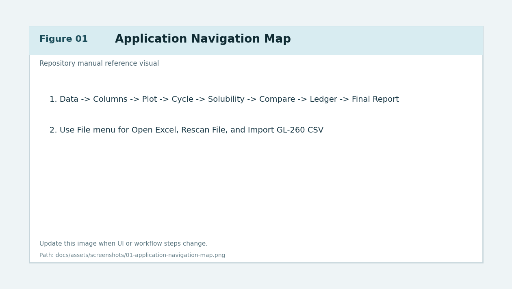
*Figure 1. Application-level navigation and workflow map.*

---

## Quickstart Workflow

### Purpose
Give an end-to-end baseline path from input data to final report.

### Preconditions
- App launched from repository root using the intended environment.
- Input data file is accessible.

### Inputs
- Workbook (`.xlsx`) or GL-260 CSV.
- Optional saved profile for quick setup.

### Step-by-step actions
1. On **Data** tab, select source file and target sheet.
2. On **Columns** tab, map all required series and click **Apply Column Selection**.
3. On **Plot Settings** tab, configure ranges and legend behavior.
4. Generate core plots and the **Combined Triple-Axis** plot.
5. Open **Cycle Analysis** and run marker detection.
6. Manually adjust peaks/troughs if needed, then confirm cycle summary.
7. Open **Advanced Solubility** and send cycle payload for equilibrium analysis.
8. Optionally open **Compare** for profile-to-profile analysis.
9. Add/validate entries in **Ledger**.
10. Configure sections in **Final Report** and generate PDF/PNG/HTML output.

### Expected outputs
- Validated cycle metrics.
- Optional speciation/equilibrium outputs.
- Final report files suitable for review and distribution.

### Common errors and recovery
- Error: Combined/final report generation blocked.
  - Recovery: ensure columns were applied after latest data or mapping changes.
- Error: Cycle output inconsistent with expected behavior.
  - Recovery: re-run marker detection with adjusted smoothing/radius and review manual edits.

### Related exports/artifacts
- Combined plot artifacts
- Cycle metrics CSV
- Speciation CSV/JSON
- Final report export files

---

## Data Import and Sheet Selection Workflow

### Purpose
Load source datasets and establish the active sheet/data context for downstream analysis.

### Preconditions
- Source file path is known.
- File format is either supported workbook or GL-260 CSV source.

### Inputs
- `File -> Open Excel...`
- `File -> Import GL-260 CSV...`
- `File -> Rescan File`
- Data tab sheet selector and import controls

### Step-by-step actions
1. Open **File -> Open Excel...** and choose workbook.
2. Confirm detected sheet list populates in Data tab.
3. Select target sheet from selector.
4. If source is CSV, choose **Import GL-260 CSV...**.
5. In CSV dialog:
   - Browse to CSV source.
   - Confirm parsed table preview.
   - Set output workbook/sheet naming.
   - Complete import and accept confirmation.
6. Click **Rescan File** when file content changes externally.
7. Confirm imported/selected sheet now contains expected headers and row counts.

### Expected outputs
- Active file path and sheet context are set.
- Data tab status confirms loaded dataset.

### Common errors and recovery
- Error: sheet list empty.
  - Recovery: verify workbook path and that file is not locked/corrupted.
- Error: CSV import fails parse.
  - Recovery: validate delimiter/header format and re-run import.
- Error: wrong sheet selected.
  - Recovery: switch sheet and re-apply column selection.

### Related exports/artifacts
- Imported workbook generated from CSV ingest flow.
- App state updated with active sheet metadata.

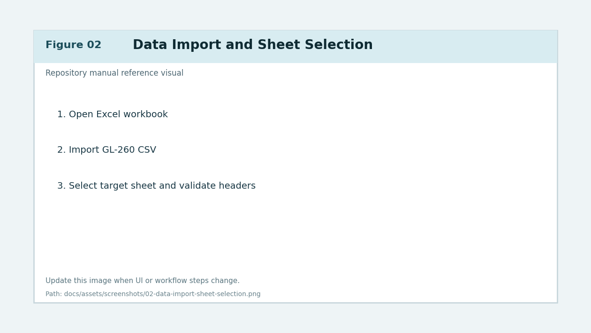
*Figure 2. Data tab workflow with sheet selection and CSV import path.*

---

## Column Mapping and Apply Workflow

### Purpose
Map source columns to pressure/temperature/derivative traces and commit mappings for analysis.

### Preconditions
- Dataset loaded and active sheet selected.
- Headers are visible and interpretable.

### Inputs
- Columns tab mapping controls.
- Required and optional series selectors.
- **Apply Column Selection** action.

### Step-by-step actions
1. Open **Columns** tab.
2. Map required fields (pressure and other required core traces).
3. Map optional channels (additional temperature or derivative traces).
4. Validate units and naming conventions for selected columns.
5. Click **Apply Column Selection**.
6. Wait for completion status (background apply paths may take noticeable time).
7. Confirm downstream tabs now recognize selected data series.

### Expected outputs
- Canonical column mappings persist into runtime state.
- Plot/Cycle/Speciation workflows are unlocked for current dataset.

### Common errors and recovery
- Error: apply fails due to invalid mapping.
  - Recovery: clear conflicting selections and remap required fields.
- Error: later workflows still report missing columns.
  - Recovery: re-open Columns and apply again after any sheet change.

### Related exports/artifacts
- Updated in-memory mapping state.
- Profile persistence payloads when saved.

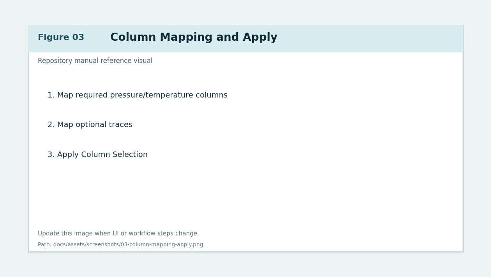
*Figure 3. Columns tab mapping and apply workflow.*

---

## Plot Settings Workflow

### Purpose
Control how plot figures render, including ranges, legends, fonts, cycle overlays, and export behavior.

### Preconditions
- Column selections applied successfully.
- Plot-ready dataset available.

### Inputs
- Plot Settings tab panels (axes, legends, cycle integration, rendering options, export DPI).
- Plot refresh/generation actions.

### Step-by-step actions
1. Open **Plot Settings** tab.
2. Configure x/y auto-range and manual range overrides where needed.
3. Set axis label text and label padding options.
4. Configure tick spacing and tick font size policies.
5. Tune legend placement and anchor controls.
6. Configure cycle integration options:
   - show/hide cycle markers on core plots
   - show/hide cycle legend
   - include/exclude moles info in legend
7. Configure global export DPI and layout behavior.
8. Generate or refresh plots and validate expected visual output.

### Expected outputs
- Plot visuals match configured ranges/style/legend policies.
- Export behavior aligns with display intent.

### Common errors and recovery
- Error: axis labels overlap or clip.
  - Recovery: adjust label pads, margins, or export padding values.
- Error: legend obscures data.
  - Recovery: re-anchor legend or enable centered/offset behavior.
- Error: stale plot rendering after setting change.
  - Recovery: trigger explicit refresh and verify full rebuild path where needed.

### Related exports/artifacts
- Core plot figures.
- Persisted plot settings in app settings/profile payloads.

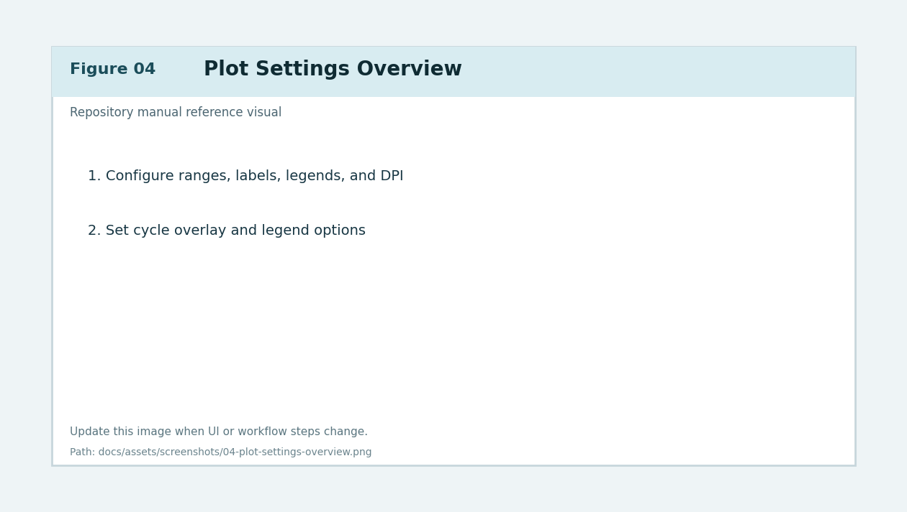
*Figure 4. Plot Settings tab controls for rendering and export behavior.*

---

## Combined Triple-Axis Plot Workflow

### Purpose
Build and tune the combined figure that overlays pressure, temperature, and derivative-oriented traces with cycle context.

### Preconditions
- Data and columns are ready.
- Plot settings are configured.

### Inputs
- Combined triple-axis controls on Plot Settings tab.
- Combined plot generation/refresh actions.
- Axis assignment toggles and right/third-axis options.

### Step-by-step actions
1. Select desired datasets for primary/right/third axis roles.
2. Enable or disable temperature and derivative axes as needed.
3. Configure derivative axis offset and axis label overrides.
4. Set combined legend behavior and cycle legend reference axis/corner.
5. Generate **Figure 1+2: Combined Triple-Axis**.
6. Validate alignment of axis scales and readability of overlays.
7. Adjust layout margin profiles for display and export parity.
8. Rebuild and verify that cycle overlays and legends remain stable.

### Expected outputs
- A single combined plot with aligned x-axis context and readable multi-axis overlays.

### Common errors and recovery
- Error: right/third axis not visible.
  - Recovery: confirm axis enable flags and dataset assignments.
- Error: cycle legend position drifts.
  - Recovery: reset legend position and apply configured reference axis/corner.
- Error: export layout differs from display.
  - Recovery: adjust export margins/label pads and validate with preview.

### Related exports/artifacts
- Combined plot image/PDF/SVG exports.
- Final report combined plot pages.

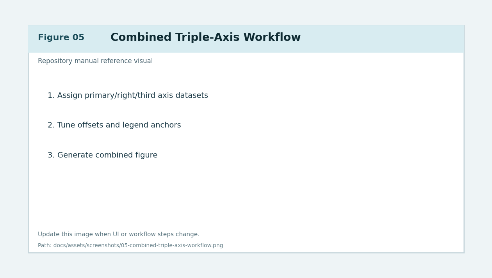
*Figure 5. Combined triple-axis controls and render workflow.*

---

## Plot Elements and Annotation Workflow

### Purpose
Add, edit, and persist visual annotations and overlays across plot workflows.

### Preconditions
- At least one plot is generated.
- Target plot tab is active.

### Inputs
- **Plot Elements...** dialogs from plot/compare/cycle preview contexts.
- Element list, style controls, placement controls, z-order controls.

### Step-by-step actions
1. Open plot element editor for target figure.
2. Add element type (line/text/shape/ring/other available element classes).
3. Set anchor coordinates and axis target.
4. Configure line width, style, fill, alpha, and layer order.
5. Apply edits and validate on live figure.
6. Repeat for multiple elements and verify no overlap conflicts.
7. Save profile/settings so element state persists.
8. Close editor and confirm refresh behavior matches final expected state.

### Expected outputs
- Target plot includes selected visual elements with persistent styling.

### Common errors and recovery
- Error: element appears on wrong axis/context.
  - Recovery: update element axis target and anchor coordinates.
- Error: element not visible.
  - Recovery: adjust z-order, color contrast, and visibility toggles.
- Error: close editor loses pending edits.
  - Recovery: ensure apply action is used before close when live update is off.

### Related exports/artifacts
- Plot exports containing persisted annotations.
- Profile-scoped element definitions.

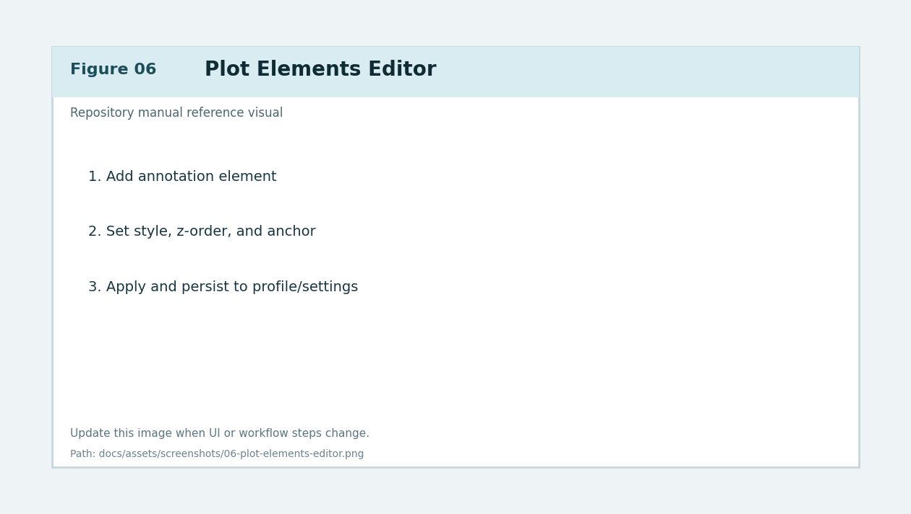
*Figure 6. Plot Elements editor and annotation lifecycle.*

---

## Cycle Analysis Workflow (Automatic and Manual)

### Purpose
Detect cycles, compute cycle metrics/moles uptake, and support manual correction of markers.

### Preconditions
- Columns applied and cycle-relevant traces selected.
- Plot context available for marker visualization.

### Inputs
- Cycle Analysis tab controls:
  - detection thresholds
  - smoothing window
  - manual snap radius
  - auto refine radius
  - marker import/export tools

### Step-by-step actions
1. Open **Cycle Analysis** tab.
2. Start automatic detection.
3. Review detected peaks/troughs and segmentation.
4. If needed, switch to manual edit behavior:
   - add marker
   - remove marker
   - undo/redo marker changes
5. Tune smoothing and snap/refine settings.
6. Re-run analysis and compare summary changes.
7. Validate cycle summary metrics and conversion/moles outputs.
8. Export markers (`JSON/CSV`) and cycle results (`CSV`) when required.
9. Push cycle payloads to Advanced Solubility workflows as needed.

### Expected outputs
- Reliable cycle segmentation with vetted peak/trough markers.
- Cycle summary text and per-cycle metrics ready for downstream workflows.

### Common errors and recovery
- Error: too many/too few cycles detected.
  - Recovery: adjust smoothing window and detection thresholds; verify selected trace.
- Error: manual edit snaps to incorrect point.
  - Recovery: increase/decrease manual snap radius and retry.
- Error: cycle summary missing conversion fields.
  - Recovery: confirm required conversion inputs/columns are mapped.

### Related exports/artifacts
- Marker exports (`JSON/CSV`)
- Cycle results CSV
- Cycle payloads consumed by Advanced Solubility and Final Report

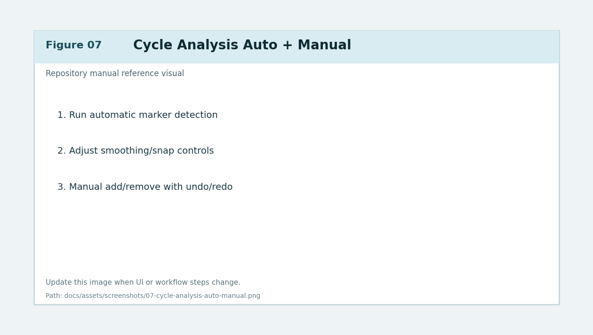
*Figure 7. Cycle Analysis tab including auto-detect and manual marker editing.*

---

## Plot and Cycle Export Workflows

### Purpose
Export reproducible plot and cycle artifacts for validation, reporting, and external review.

### Preconditions
- Relevant plot or cycle view already generated.

### Inputs
- Plot export controls (`PNG/PDF/SVG`).
- Global export DPI setting.
- Cycle export controls (summary PNG, results CSV, marker JSON/CSV).

### Step-by-step actions
1. From target plot tab, open export controls and select formats.
2. Confirm output dimensions and DPI.
3. Export and verify files open correctly.
4. In Cycle Analysis, export:
   - marker set
   - cycle results table
   - summary image artifacts
5. For timeline workflows in Advanced Solubility, use dedicated timeline export controls.
6. Archive artifacts using run-specific naming convention.

### Expected outputs
- Complete set of reproducible visual and tabular artifacts.

### Common errors and recovery
- Error: export size mismatch.
  - Recovery: verify export DPI and plot dimension settings.
- Error: missing legend/annotation in export.
  - Recovery: re-generate plot and ensure overlays are enabled before export.
- Error: file write denied.
  - Recovery: choose writable destination and avoid locked/open files.

### Related exports/artifacts
- Plot file set (`PNG/PDF/SVG`)
- Cycle summary and CSV exports

---

## Advanced Speciation and Equilibrium Workflows

### Purpose
Perform chemistry-driven analyses including cycle-to-speciation projections, planning guidance, and equilibrium summaries.

### Preconditions
- Cycle analysis has completed or manual cycle payload is defined.
- Advanced Solubility tab is available and initialized.

### Inputs
- Advanced Solubility controls:
  - send cycle to solubility
  - cycle timeline options
  - analysis dashboard selectors
  - model mode and diagnostics controls
  - export actions (PNG/CSV/JSON/timeline artifacts)

### Step-by-step actions
1. Open **Advanced Solubility** tab.
2. Send cycle payload from Cycle Analysis.
3. Choose analysis mode/model settings for speciation/equilibrium workflow.
4. Run computation and inspect:
   - Analysis dashboard tiles
   - selected-cycle notes
   - dashboard metrics
   - cycle timeline visualization/table
5. For Analysis workflow measured-pH anchoring:
   - add one or more rows in `Measured pH Anchors` (`Cycle`, `Measured pH`)
   - keep rows aligned to detected cycle IDs
   - use `Clear Anchors` to reset the row editor when needed
   - run Analysis or click **Recompute Calibration**
6. Use **Analysis Actions** panel (directly below **Guided Steps**) for:
   - **Import from Cycle Analysis**
   - **Run Analysis**
   - **Recompute Calibration**
   - editing `Cycle timeline plot title`
7. Verify anchored outputs:
   - measured pH marker appears on cycle timeline plot
   - corrected pH trajectory appears alongside original/planning trajectories
   - corrected per-cycle and cumulative CO2 uptake values appear next to original values
   - dashboard tile **Reaction Progress** uses corrected-primary completion/regime text and shows required CO2 context
   - dashboard tile **Completion Meter** shows adjacent pre-anchor and corrected completion gauges
   - dashboard tile **Speciation Snapshot** shows latest corrected speciation and required-CO2 context
   - Speciation Snapshot also surfaces anchor count/source usage, learning controls, and terminal-objective endpoint diagnostics
   - dashboard tile **Target Gap & CO2 Needed** visualizes corrected cumulative uptake vs required total to the target pH slider value
   - dashboard tile **Forecast to Target** shows slowdown-aware remaining cycle/time forecast with confidence
   - **Warnings / Narrative / Math Context** now renders explicit context sections (`Primary`, `Forced`, `Reaction`, `Closed-System`, `Analysis Alignment`) with context-specific metrics to avoid forced-vs-primary conflicts
8. Edit `Cycle timeline plot title` (Planning/Analysis/Reprocessing shared field):
   - default format is `<Job Information> Reaction Simulation`
   - commits apply on `Enter` or when the input loses focus (`FocusOut`)
   - typing alone does not trigger full timeline refresh
9. Use **Layout Manager...** (next to **Plot Preview**) to tune timeline layout-manager checks before final display/export.
10. Use cycle selector tools to inspect cycle-specific behavior.
11. Export outputs:
   - summary PNG
   - CSV species table
   - JSON summary
   - timeline CSV/plot/table
12. Use **Send Dashboard Stats to Ledger** when values should be captured in ledger entries (corrected-primary uptake/yield are prefilled; raw baselines remain in notes).
13. In Analysis dashboard verify tile coverage:
   - Target pH controls, Reaction Progress, Forensic Comparison KPIs
   - Speciation Snapshot, Reaction Overview visuals, All-cycles pH sweep preview
   - Warnings/Narrative/Math context
   - Cycle Comparison Explorer, Cycle Speciation Timeline Explorer/plot, and Selected-Cycle Notes and Export remain in their existing locations.

### Expected outputs
- Speciation/equilibrium summaries tied to cycle-level data.
- Timeline artifacts and dashboard metrics suitable for compare/report/ledger.
- Measured-pH anchor editor rows persist globally in `solubility_inputs` and restore on Analysis tab build/restart.
- Measured-pH anchored correction payloads remain persisted per profile and auto-applied on reload when chemistry/model basis matches.

### v4.11.0 Release Note (Cycle Timeline Layout Manager + Splash-Gated Verification)
- Added a dedicated **Layout Manager...** button beside **Plot Preview** in the Cycle Speciation Timeline actions row.
- Added a timeline-specific layout-manager dialog with controls for:
  - enable/disable,
  - strict mode,
  - max solve passes,
  - legend/xlabel conflict checks,
  - right-axis label/tick conflict checks,
  - min/max legend-to-xlabel gap,
  - minimum axis-label-to-tick-label gap.
- Timeline layout verification now runs behind splash/loading overlays when layout-driving signatures change.
- Added signature-based verification triggers so display/preview solves react to timeline layout-manager settings, axis spacing settings, legend mode, and figure geometry changes.
- Fixed Cycle CO2 axis label padding behavior so `pco2_axis_labelpad` now changes final attached right-label spacing.
- Added targeted regressions for layout-manager conflict auto-fix paths, splash gating behavior, preview rebuild-on-apply behavior, and preference normalization round-trip.

### v4.10.0 Release Note (Anchor Learning + Warning Context Alignment)
- Added Analysis anchor-learning controls in Developer Tools Runtime diagnostics:
  - learning enabled toggle,
  - terminal pH low/high range,
  - terminal objective weight,
  - reset learned anchor history for active profile,
  - dump anchor-learning diagnostics snapshot.
- Extended measured-pH calibration payloads (Rust and Python) with anchor usage diagnostics, prior-learning usage diagnostics, terminal-objective metadata, objective component breakdown, and endpoint diagnostics.
- Added context-separated warning assembly/rendering so forced pH warnings are shown in a dedicated **Forced Scenario Context** section and no longer conflict with primary snapshot ionic strength/charge residual values.
- Added Analysis alignment-audit pass that reconciles timeline tail vs dashboard summary mismatches and surfaces audit status/mismatch diagnostics.
- Speciation Snapshot dashboard tile now reports anchor usage counts/source breakdown and terminal-objective diagnostics.

### v4.9.2 Release Note (Cycle Timeline Layout + Advanced Speciation Tile Stacking)
- Fixed Advanced Speciation workflow tile host ordering so **Detailed Math Preview** remains below **Cycle Speciation Timeline Explorer**.
- Updated cycle timeline layout solving to include bottom legend spacing relative to the shared x-label band.
- Kept the cycle CO2 uptake axis attached while applying `pco2_axis_spine_offset` to shift the right-side y-label outside the tick-label column.
- Added regressions for timeline bottom-legend/xlabel overlap prevention, attached-axis label offset application, and timeline/math tile row ordering.

### v4.9.1 Release Note (Rust Import Hardening + Analysis Persistence/Layout Updates)
- Rust setup now runs interpreter-pinned subprocess verification of extension import path, interface id/version, and required kernels.
- Added startup/runtime `restart_required` state when subprocess verification passes but in-process module reload remains stale/deprecated.
- Startup preflight, workflow setup, and Developer Tools validation now report restart-required cleanly and avoid repeated misleading install loops.
- Analysis measured-pH anchor row editor now persists globally in `settings["solubility_inputs"]` and restores deterministically on tab build.
- **Analysis Actions** moved out of dashboard tiles to a dedicated panel directly below **Guided Steps**.
- Legacy dashboard settings containing `analysis_actions` are auto-normalized to current tile schema.
- Target pH slider synchronization is re-applied after control wiring, on workflow tab changes, and on initial tab render.

### v4.8.6 Release Note (Analysis Dashboard Consolidation + Forecasting)
- Analysis workflow input mode was consolidated into Analysis dashboard tiles for controls, KPIs, visuals, and warnings/math context.
- Added `Target Gap & CO2 Needed` tile to emphasize corrected cumulative uptake, required total uptake to target pH, and additional CO2 demand.
- Added `Forecast to Target` tile with slowdown-aware forecasting (knee detection, pre/post trend rates, projected remaining cycles/time, confidence).
- Analysis slider target pH now synchronizes and persists with forced-target mirror values so warnings and math context use the active slider value.
- `Key Metrics` panel was removed from Analysis workflow input mode because equivalent coverage is provided by Speciation Snapshot/dashboard summaries.
- Timeline bottom-legend drag sync now captures bbox placement semantics and keeps wide-under-x-axis legends visible by reserving extra bottom subplot margin.
- Analysis run/recompute result restore now requires matching workspace, analysis-input, and cycle signatures before auto-restore.

### v4.8.5 Release Note (Timeline Title Commit + Job Information Default)
- Cycle Speciation Timeline title edits now commit on explicit input actions (`Enter` and `FocusOut`) instead of per-keystroke persistence.
- Timeline title commit now applies through a lightweight title redraw path, avoiding full timeline refresh loops during title typing.
- Default timeline title now derives from `Suptitle (Job Information)` with canonical format `<Job Information> Reaction Simulation`.

### v4.8.4 Release Note (Timeline Preview Legend Sync)
- Cycle Timeline Plot Preview now enables draggable main-legend editing parity with combined preview behavior.
- Closing Timeline Plot Preview now applies the dragged preview legend position to the displayed timeline legend.
- Timeline plot exports now honor the current in-session timeline legend location captured from preview drag actions.

### Common errors and recovery
- Error: solver/model unavailable.
  - Recovery: verify optional dependencies and fallback behavior; re-run in supported mode.
- Error: timeline export unavailable.
  - Recovery: ensure timeline rows are populated and required optional table dependency is installed.
- Error: Analysis timeline main legend missing or off-canvas in preview/export.
  - Recovery: update to `v4.8.1+`; timeline legend refresh now preserves valid user placement and auto-recovers to an on-canvas anchor when stale/off-canvas state is detected.
- Error: timeline legend position snaps back after dragging it in Timeline Plot Preview.
  - Recovery: update to `v4.8.4+`; preview close now captures the dragged timeline legend location and syncs that location to the displayed timeline and in-session timeline exports.
- Error: timeline title input appears to trigger repeated refresh/select loops while typing.
  - Recovery: update to `v4.8.5+`; title edits now commit on `Enter`/`FocusOut`, and typing alone no longer runs full timeline refresh.
- Error: cycle CO2 uptake y-label overlaps the lower-panel right-axis tick labels.
  - Recovery: update to `v4.9.2+`; timeline layout now applies right-label offset placement while keeping the axis attached.
- Error: changing Cycle CO2 axis label padding does not change timeline right-label spacing.
  - Recovery: update to `v4.11.0+`; attached right-label x solving now includes `pco2_axis_labelpad`, and layout verification reruns when timeline layout settings change.
- Error: selected cycle mismatch.
  - Recovery: re-sync cycle selection and refresh dashboard/timeline views.
- Error: measured pH anchor not applied.
  - Recovery: confirm Analysis workflow is active, `Measured pH cycle` is within detected cycle count, and pH is in `[0, 14]`, then re-run **Recompute Calibration**.
- Error: Warnings / Narrative / Math Context says "No measured pH provided" even after anchor recompute.
  - Recovery: update to `v4.8.3+`; Analysis guidance now consumes `Measured pH anchor` when final/slurry pH fields are empty and anchor cycle is valid.
- Error: Analysis progress requests Planning-only delta-P/manual CO2-per-cycle inputs.
  - Recovery: update to `v4.8.2+`; Analysis mode now builds fallback reference traces from cycle uptake + Analysis chemistry inputs and no longer requires Planning-only controls for progress text.
- Error: Analysis warnings still display a stale forced target pH value after moving the slider.
  - Recovery: update to `v4.9.1+`; Analysis slider sync now re-applies on workflow changes and initial tab load in addition to direct slider movement.
- Error: Forced warning text appears to conflict with Speciation Snapshot ionic strength or charge residual.
  - Recovery: update to `v4.10.0+`; warnings are now context-separated and forced-scenario diagnostics are rendered under explicit forced context headers with their own metrics.
- Error: Rust backend install/build reports failure even though build succeeded and interface appears current.
  - Recovery: update to `v4.9.1+`; runtime now reports `restart_required` when the current process holds a stale extension image and restart the app to activate Rust acceleration.
- Error: dragged bottom legend in Cycle Timeline preview is clipped or does not sync on close.
  - Recovery: update to `v4.8.6+`; timeline legend sync now captures loc+bbox placement and reserves enough bottom margin for wide bottom legend mode.

### Related exports/artifacts
- Solubility summary PNG
- Solubility CSV/JSON
- Timeline CSV/plot/table exports

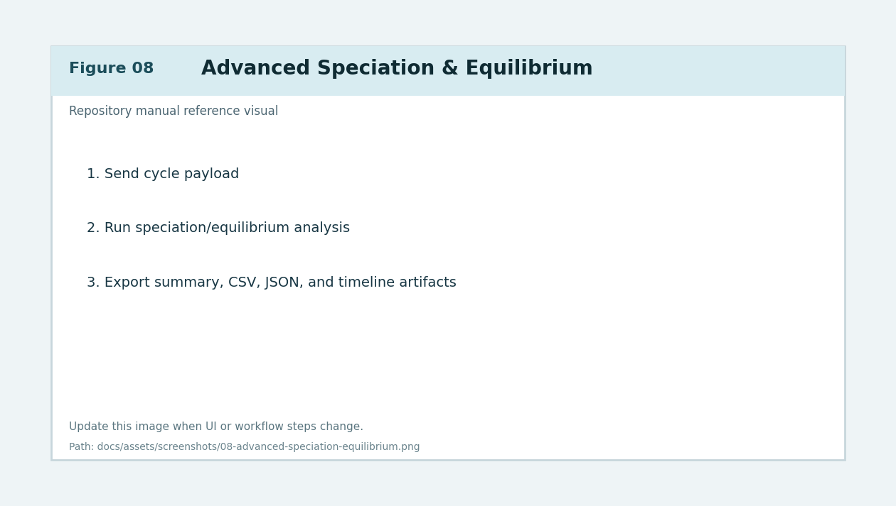
*Figure 8. Advanced Solubility workflow with cycle timeline, exports, and ledger handoff.*

---

## Compare Profiles Workflow

### Purpose
Compare two profile runs side-by-side and quantify differential cycle/yield behavior.

### Preconditions
- Two valid profiles exist with usable cycle/analysis context.

### Inputs
- Compare tab profile selection controls.
- Side-specific plot settings and optional plot elements.
- Compare cycle table export controls.
- `Open In Cycle Analysis` action for side-specific marker review.

### Step-by-step actions
1. Open **Compare** tab.
2. Assign profile A and profile B.
3. Load each profile and validate status chips/diagnostics.
4. Configure side-specific titles and rendering overrides if needed.
5. Render both sides and inspect cycle/yield deltas.
6. Use `Open In Cycle Analysis` to inspect side marker fidelity.
7. Export compare cycle table CSV when needed.
8. Optionally export compare interactive HTML if used in your reporting flow.

### Expected outputs
- Side-by-side visual and table-based comparison evidence.

### Common errors and recovery
- Error: one side blank or stale.
  - Recovery: re-load profile bundle and re-render selected side.
- Error: mismatched axis ranges reduce comparability.
  - Recovery: enable/refresh locked x-axis behavior and verify common range policy.
- Error: compare table empty.
  - Recovery: ensure both profiles contain cycle outputs and cycle analysis completed.

### Related exports/artifacts
- Compare cycle table CSV
- Compare interactive HTML/report artifacts (if enabled in workflow)

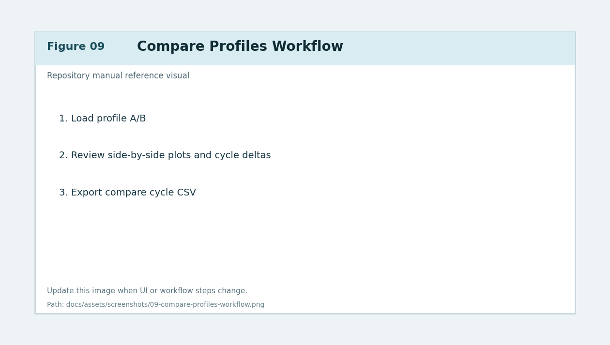
*Figure 9. Compare tab profile assignment, render, and export workflow.*

---

## Ledger Workflow

### Purpose
Capture cross-run metrics, support manual and prefilled entries, and export consolidated records.

### Preconditions
- Optional profile/speciation outputs ready for prefill.

### Inputs
- Ledger tab controls:
  - add/edit/remove rows
  - profile prefill actions
  - sort/filter options
  - custom columns/formula fields
  - CSV export

### Step-by-step actions
1. Open **Ledger** tab.
2. Add a new line manually or use profile/speciation prefill flow.
3. Confirm identifiers (`Project #`, `Batch #`, `Item #`) where required.
4. Review cycles, uptake, yield fields, and notes.
5. Apply sorting/filtering to focus the current review set.
6. Validate formula/custom-column outputs if configured.
7. Export visible ledger rows to CSV.

### Expected outputs
- Auditable run-level ledger entries suitable for operational tracking.

### Common errors and recovery
- Error: prefill values missing.
  - Recovery: ensure source profile contains cycle/speciation payloads and rerun prefill.
- Error: formula value invalid.
  - Recovery: correct formula expression and permitted field references.
- Error: export file empty.
  - Recovery: clear filters or ensure rows are visible before export.

### Related exports/artifacts
- Ledger CSV export
- Profile metadata + cycle/speciation metrics snapshots

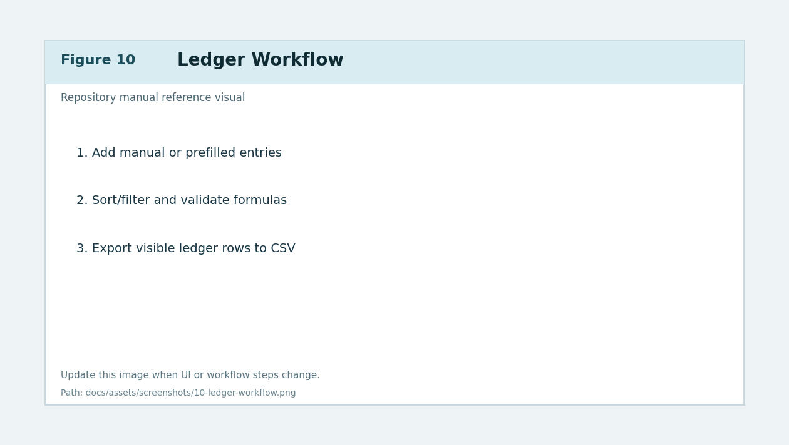
*Figure 10. Ledger entry management, sorting/filtering, and CSV export.*

---

## Final Report Workflow

### Purpose
Assemble and export final, shareable reporting packages using selected sections and layout rules.

### Preconditions
- Required columns applied.
- Plot/cycle/speciation inputs available for selected report sections.

### Inputs
- Final Report tab controls:
  - title and narrative fields
  - section selection and ordering
  - orientation/layout mode
  - section captions/headers
  - template save/load actions
  - generation actions (`PDF`, `PNG`, `HTML`, combined)

### Step-by-step actions
1. Open **Final Report** tab.
2. Enter report title and required narrative metadata.
3. Select report sections and arrange section order.
4. Configure orientation and fit/layout mode.
5. Enable/disable section headers/captions and preview page layout.
6. Save or load report templates as needed.
7. Click **Generate Final Report...** and choose output type:
   - PDF
   - PNG summary
   - Interactive HTML
   - combined multi-format generation
8. Verify generated outputs and pagination/caption correctness.

### Expected outputs
- Report artifacts matching configured structure and styling.

### Common errors and recovery
- Error: report generation blocked by stale columns.
  - Recovery: run **Apply Column Selection** again and retry.
- Error: combined plot unavailable for report.
  - Recovery: regenerate combined plot and ensure required source traces exist.
- Error: HTML preview opens but missing pages.
  - Recovery: ensure selected sections produce renderable figures/tables.

### Related exports/artifacts
- Final report PDF pages
- Final report PNG summary
- Final report interactive HTML

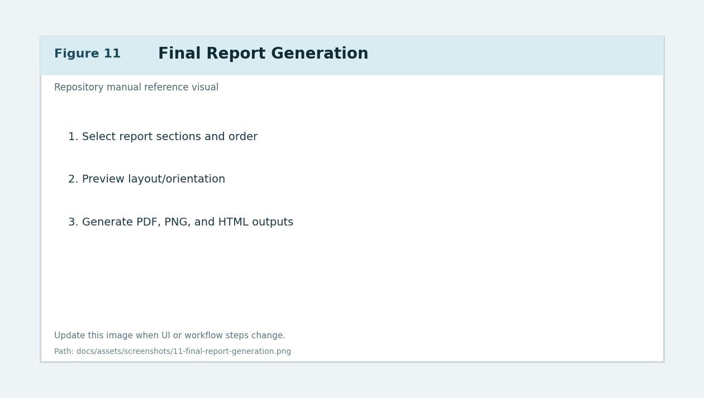
*Figure 11. Final Report tab configuration and multi-format generation workflow.*

---

## Profiles and Settings Persistence

### Purpose
Store and restore repeatable analysis state across sessions and datasets.

### Preconditions
- A valid configuration has been created in one session.

### Inputs
- Profiles menu actions.
- Settings persistence behavior (`settings.json` and `profiles/` payloads).

### Step-by-step actions
1. Configure tabs and workflows for the current run.
2. Save profile from Profiles menu.
3. Load profile in a future session and verify expected state restoration.
4. Confirm restored state across:
   - selected traces
   - plot settings
   - cycle markers (if captured)
   - compare and final report preferences
5. Export selected profile when needed for transfer/sharing.

### Expected outputs
- Consistent reproducibility for recurring workflows.

### Common errors and recovery
- Error: profile restore incomplete.
  - Recovery: confirm profile schema fields and re-save from current app version.
- Error: settings corruption symptoms.
  - Recovery: inspect/reset `settings.json`, then reload known-good profile.

### Related exports/artifacts
- `profiles/*.json`
- `settings.json`

---

## Troubleshooting and Recovery Matrix

### Purpose
Provide actionable recovery paths for common user-impacting issues.

| Symptom | Likely cause | Recovery |
|---|---|---|
| Sheet selector empty | Workbook path invalid or locked file | Re-open workbook, verify path and file access |
| Apply Column Selection fails | Missing required mapping | Re-map required columns and apply again |
| Combined plot missing axis | Axis role not enabled/assigned | Enable right/third axis and confirm dataset assignment |
| Cycle count unrealistic | Detection tuning mismatch | Adjust smoothing/snap/refine thresholds and rerun |
| Speciation export unavailable | No valid analysis payload | Re-send cycle payload and rerun analysis |
| Compare rows empty | Missing cycle data in one profile | Recompute cycles and reload profile pair |
| Ledger prefill incomplete | Source profile missing metadata | Update source profile or fill fields manually |
| Final report blocked | Columns changed since last apply | Re-run Apply Column Selection, then regenerate |

### Related exports/artifacts
- Debug logs: `gl260_debug.log*`
- Validation helper: `scripts/validate_rust_backend.py`

---

## Advanced / Power User Appendix

### Purpose
Document optional runtime controls and diagnostics without interrupting core user flow.

### Included advanced topics
- Runtime/dependency diagnostics and capability checks.
- Developer Tools logging/performance controls.
- Optional Rust acceleration validation.
- Timeline table export validation utilities.
- Interpreter/environment consistency checks.

### Recommended advanced workflow
1. Use installer script for deterministic environment setup.
2. Validate runtime dependencies before benchmark-heavy operations.
3. Use diagnostics when output parity or performance behavior changes.
4. Keep fallback behavior available and verified.

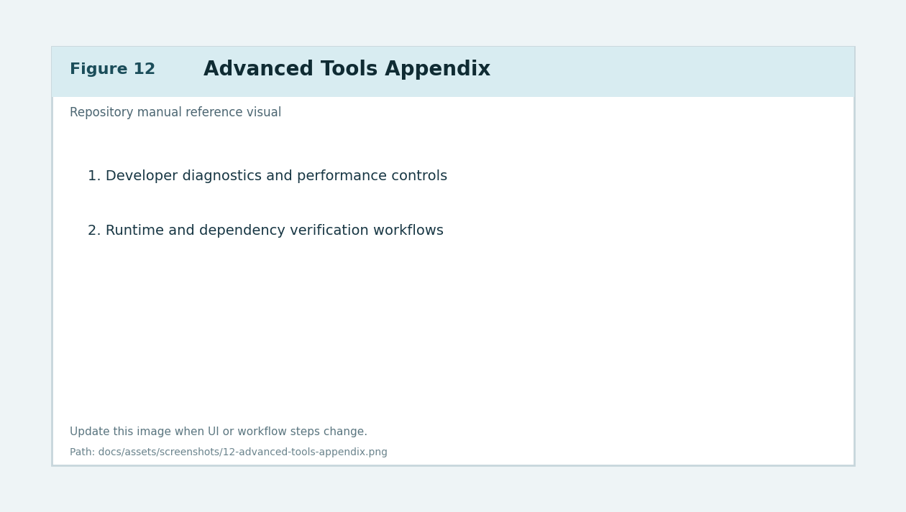
*Figure 12. Advanced tools and diagnostics appendix reference visual.*

---

## Screenshot Contract and Asset Index

### Purpose
Define required structure and quality criteria for screenshot-driven documentation.

### Contract
- All manual images are stored in `docs/assets/screenshots/`.
- Filenames follow a numeric prefix for deterministic ordering.
- Every image reference includes descriptive alt text and a figure caption.
- UI-heavy sections should use numbered callouts in image content where practical.
- If UI changes invalidate screenshots, update both image and caption in same patch.

### Asset index

| Figure | File | Covered workflow |
|---|---|---|
| Figure 1 | `assets/screenshots/01-application-navigation-map.png` | Navigation map |
| Figure 2 | `assets/screenshots/02-data-import-sheet-selection.png` | Data import + sheet selection |
| Figure 3 | `assets/screenshots/03-column-mapping-apply.png` | Column mapping |
| Figure 4 | `assets/screenshots/04-plot-settings-overview.png` | Plot settings |
| Figure 5 | `assets/screenshots/05-combined-triple-axis-workflow.png` | Combined plot |
| Figure 6 | `assets/screenshots/06-plot-elements-editor.png` | Plot elements |
| Figure 7 | `assets/screenshots/07-cycle-analysis-auto-manual.png` | Cycle analysis |
| Figure 8 | `assets/screenshots/08-advanced-speciation-equilibrium.png` | Advanced speciation |
| Figure 9 | `assets/screenshots/09-compare-profiles-workflow.png` | Compare |
| Figure 10 | `assets/screenshots/10-ledger-workflow.png` | Ledger |
| Figure 11 | `assets/screenshots/11-final-report-generation.png` | Final report |
| Figure 12 | `assets/screenshots/12-advanced-tools-appendix.png` | Advanced appendix |

### Related maintenance rules
- Release updates must follow `RELEASE_CHECKLIST.md`.
- Do not merge user-facing workflow changes without manual updates.

---

## Versioning Note

This manual tracks application behavior for the currently active repository state and must be updated incrementally with each user-facing feature change.
